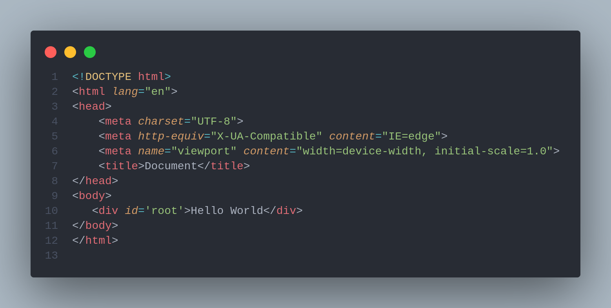

# 🏁 The Basic javascript "Hello world"

Going back to basics allows us to review knowledge and, or we can put it this way, connect the dots on ambiguous aspects.

Before tackling **React**, maybe we should review how to make a basic web page using **Vanilla JavaScript.**

## **Minimal web page**

Basically, the most minimal thing that we can call a web page is just one **HTML File** that says "Hello world".

Like this one&#x20;




**The browser parses this HTML code and creates the DOM (Document Object Model). The browser, then, exposes the DOM to JavaScript. At that point, your web page will become interactive where you can do the basic events that we will talk about in another Section.**


To read more about the **Document Object Model (DOM)**:




Rajakvk’s Blog


Now**,** if we want to add some **JavaScript** we can just use the **script tag**&#x20;



**ES6 modules**

**In order to ensure that the ES6 features to works, the `<script>` tag in your HTML file will need to have the attribute `type="module"`. Surprisingly, this actually works as-is in most modern browsers.**


## DOM Manipulation

The first question ever that I asked myself was how can **JavaScript** interact with the **DOM**?

How can I really create, modify or delete **DOM** element using **JavaScript**? These questions lead to my two first **JavaScript** commands I wrote:



**The DOM represents a document with a logical tree. Each branch of the tree ends in a node, and each node contains objects. DOM methods allow programmatic access to the tree. With them, you can change the document's structure, style, or content.**


Manipulating an Element is easy we can add styling or getting and adding content. Let's try to play with some stuff

```tsx
<!DOCTYPE html>
<html lang="en">
  <head>
    <meta charset="UTF-8" />
    <meta http-equiv="X-UA-Compatible" content="IE=edge" />
    <meta name="viewport" content="width=device-width, initial-scale=1.0" />
    <title>Document</title>
    /* just some indicative styling */
    <style>
      #root {
        background-color: aqua;
      }
    </style>
  </head>
  <body>
    <script type="module">
      const root = document.createElement('div');

      // Adding htmlElement attributes to our root element
      // https://developer.mozilla.org/en-US/docs/Web/API/Element/setAttribute
      root.setAttribute('id', 'root');
    
      // https://developer.mozilla.org/en-US/docs/Web/API/Node/textContent
      root.textContent = 'Hello world';
      
      // We always need to append the root element to the document
      document.body.append(root);
    </script>
  </body>
</html>
```

As you can see, I added the **id selector** and the **class selector** to the root element. I added some styling and even added our "hello world" text.

Since we are always able to use **HTML** tags to create the **div element** with its **attributes**, I just wanted to show how **JavaScript** can leverage all of that in code. &#x20;


**People were creating HTML on the server and then layering JavaScript on top of it for interactivity. However, as the requirements for that interactivity grew more difficult, this approach resulted in applications that were difficult to maintain and had performance issues.**&#x20;

**As a result, instead of defining the DOM in hand-written HTML, modern JavaScript frameworks were developed to address some of the issues like our beloved React.**


## References and articles :&#x20;




