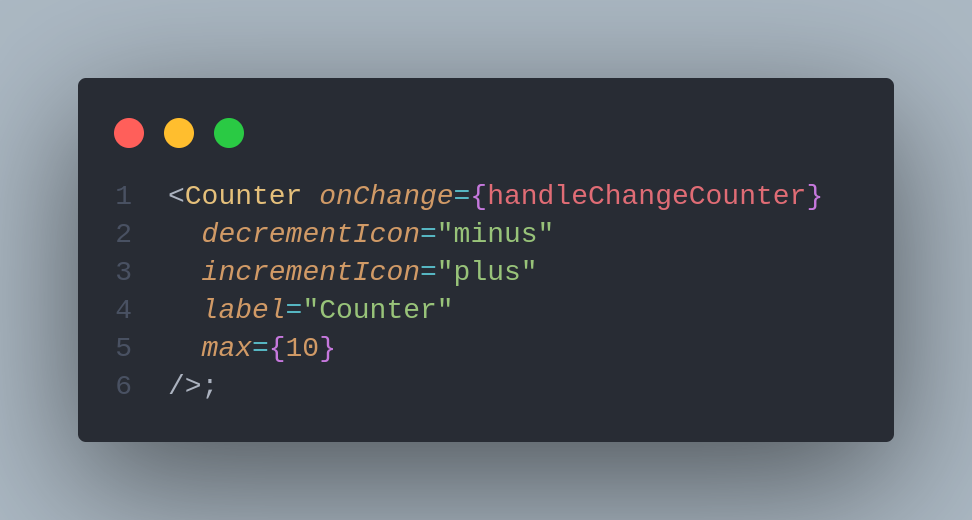
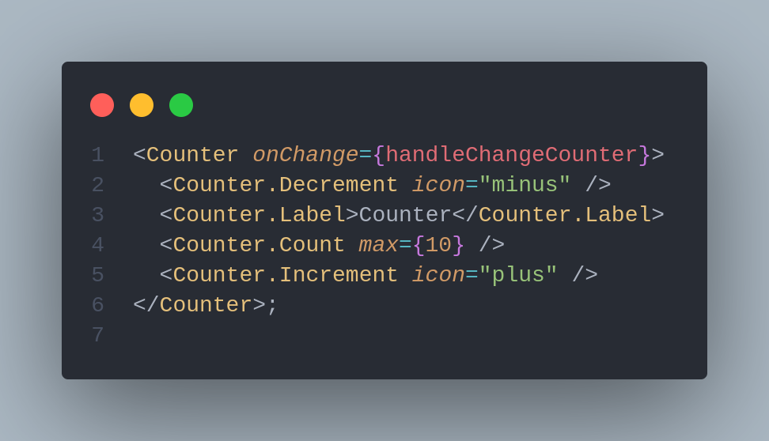
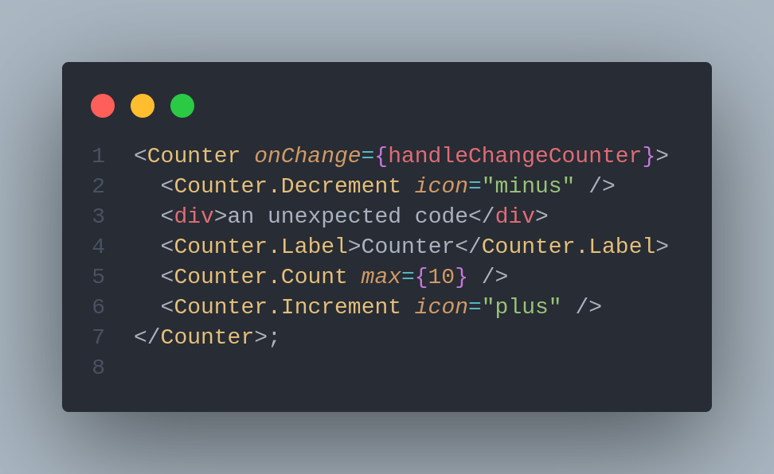

# ⚠ Compound Components Pattern

## Compound Components Pattern <a href="#6eaa" id="6eaa"></a>

This pattern allows creating expressive, declarative and flexible API for complex components. , without unnecessary [pr](https://kentcdodds.com/blog/prop-drilling)[op drilling](https://kentcdodds.com/blog/prop-drilling).&#x20;

You build the component using multiple loosely coupled child components. Each of them performs a different task, yet they all share the same implicit state. When put together, these child components make up our compound component.

You should consider using this pattern if you want to make your **** component more customizable, with a better separation of concern and an understandable API.

### Why use the Compound Component pattern? <a href="#why-use-the-compound-component-pattern" id="why-use-the-compound-component-pattern"></a>

let's imagine that we were going to implement a custom select. A naive implementation would look something like this:

```jsx
<CustomSelect
  options={[
    {value: '1', display: 'Option 1'},
    {value: '2', display: 'Option 2'},
  ]}
/>
```

This works fine, but it's less extensible/flexible than a compound components API. For example. What if I want to supply additional attributes on the `<option>` that's rendered, or I want the `display` to change based on whether it's selected? We can easily add API surface area to support these use cases, but that's just more for us to code and more for users to learn. That's where compound components come in really handy!\


To reiterate, the main advantage of building complex components this way is how easy it is to use them. Thanks to the implicit state, the inner workings of the compound component are hidden from the clients. At the same time, the clients get the flexibility to rearrange and customize the child components in any way they please.

Notice how we declaratively listed the content of the Accordion yet didn’t have to meddle with its inner state.

So let’s go over the advantages of using the Compound Component pattern one last time:

1. The API for your component is declarative.
2. Your child components are loosely coupled. That makes it easy to reorder, add and remove the child component without affecting its siblings.
3. Much easier to style and change the design of the component.

### Libraries using this pattern&#x20;





### Advantages

Reduced API complexity: Instead of putting all props in one huge parent component and descending into sub UI components, each prop is tied to the most appropriate SubComponent.



To this:



Flexible markup structure: The component's UI has great flexibility and can create multiple cases from one component. For example, the user can change the order of SubComponents or decide which of them should be displayed.

Separation of concerns: Most of the logic is contained in the main Counter component, and React.Context is used to share the states and handlers of all child components . This allows for a clear separation of responsibilities.

.png>)

### Disadvantages

Too much flexibility in the UI: More flexibility means it's more likely to cause unexpected behavior. For example, there may be unneeded child components, the child components may be out of order, and the necessary child components may not exist.\
Depending on how you want your users to use your component, you may want to limit your flexibility to some extent.



**JSX too heavy**: Applying this pattern JSX The number of lines increases, especially if you are using a linter like EsLint or a code formatter like Prettier . It's not a big deal at the single-component level, but the difference becomes more apparent as you scale up.


As a side note, a lot of UI libraries like ant D use `.` for their compound component API like so:

```jsx
<Dropdown text="File">
    <Dropdown.Menu>
      <Dropdown.Item text="New" />
      <Dropdown.Item text="Open..."  />
      <Dropdown.Item text="Save as..."  />
    </Dropdown.Menu>
</Dropdown>
```

This approach is strictly optional and you can write your component however you prefer. It doesn’t affect the end result in any significant way.


{% embed url="https://codesandbox.io/embed/react-patterns-uenl15?fontsize=14&hidenavigation=1&module=%2Fsrc%2Fpatterns%2Fcompound-component%2FUsage.js&theme=dark" %}

## References and articles :


