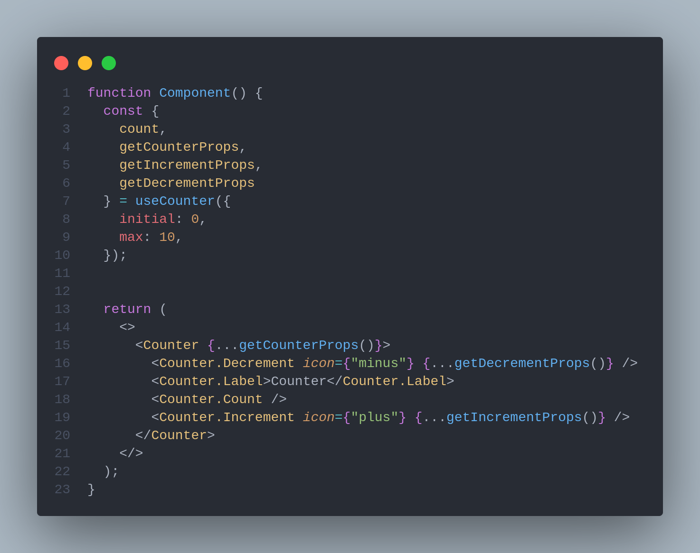
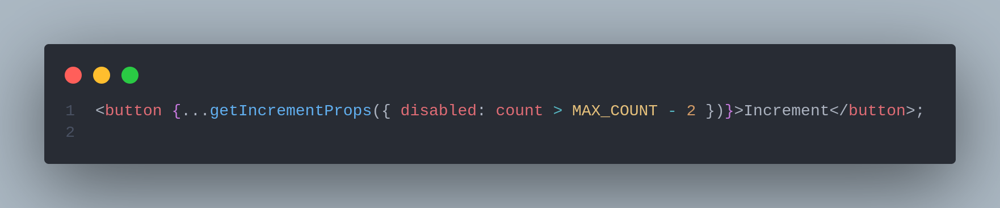

# ⚠ Props Getters Pattern

While this pattern gives you a lot of control, it's harder to integrate your components. Users have to deal with the many props of native hooks themselves and rewrite the logic themselves. The Props Getters pattern hides this complexity by providing a list of props getters instead of exposing the default props. A getter is a function that returns a bunch of props, and gives it a meaningful name so that users can easily connect to the correct JSX element.

## Libraries that use this pattern





## Advantages

Easy to use: Provides an easy way to integrate components and hides complexity. Users just need to connect the correct getter to the correct JSX element.

Flexibility: Users can override the props contained in the getter if needed for a specific use case.

## &#x20;Disadvantages

Lack of visibility: The abstraction provided by getters makes it easier to implement components, but can feel like a "magic box" with no visible insides. To redefine a component correctly, the user needs to know what the list of props exposed by the getter is and how changing one of them will affect the internal logic.

{% embed url="https://codesandbox.io/embed/react-patterns-uenl15?fontsize=14&hidenavigation=1&module=%2Fsrc%2Fpatterns%2Fprops-getters%2FUsage.js&theme=dark" %}

## References and articles :




