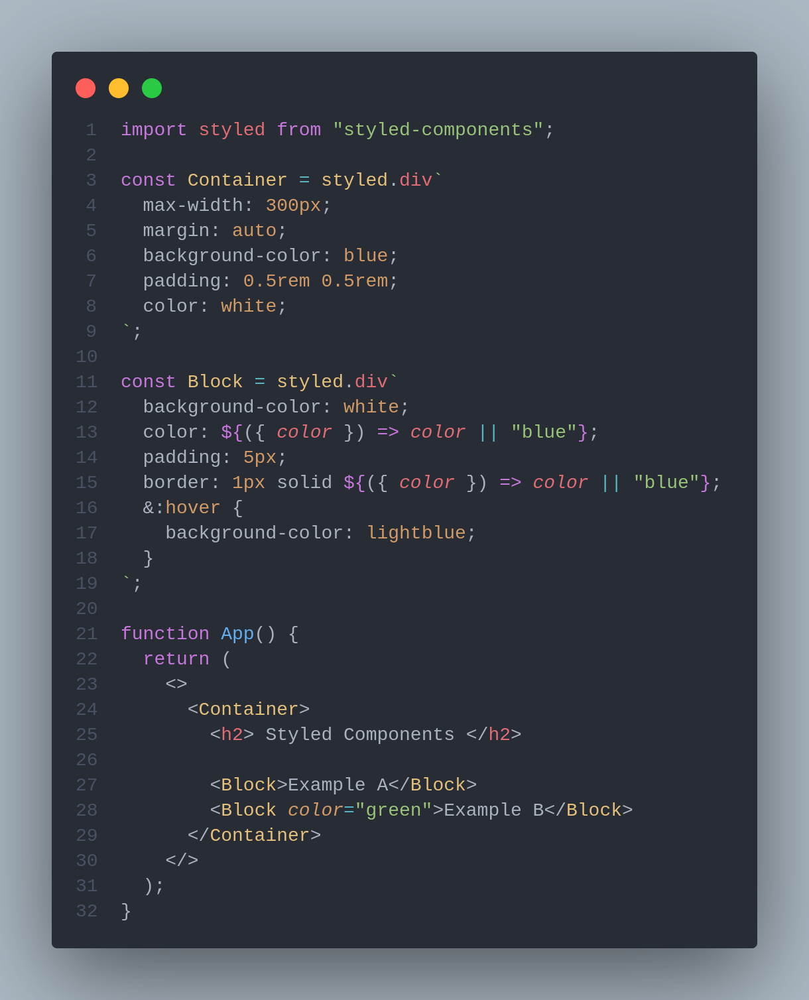

# 🆗 CSS in js :Styled-components

## Introduction

CSS-in-js is a quick implementation solution. Even though we recognize the benefits, which are numerous, its limitations become apparent very quickly when the Components implementation is poorly designed and unutilized. Currently, only a few websites use css-in-js. This begs the question of why we are following so-called cutting-edge tools that are only used by a small number of people in the industry. Even those who advocate for them do not use it. Or maybe just in a few tech showcases. CSS preprocessing is a tried-and-true, high-performance technique. It necessitates that developers work with CSS files and structure the components with more traditional tags. When we want to improve performance without sacrificing velocity, this is the de facto solution.

CSS-in-JS has similar ideas to Tailwind regarding `separation of concerns`, namely, that there is no separation between markup and styling, however styled-components provides a way to write regular CSS within your Javascript code, which is especially handy for things like theming.

### **CSS-in-JS: Pros**

**Naming + Context Switching**

Same as with utility classes above, styled-components also alleviates these two problems with CSS. Your CSS code lives right in the same file as your markup and you do not have to worry about switching back and forth.

**Scoped Styles**

Again, like Tailwind, styles are scoped to a specific component. This results in way easier maintenance since styles can be found side by side with the markup they refer to. The worry of affecting anything else within the app is eliminated.&#x20;

This also enforces best code practices when it comes to making small, reusable components instead of huge, long components that contain what could be multiple components. By forcing you to think about each element you want to style as a component, it also enforces extracting away reusable React components where possible.

**JS Functionality within CSS**

Because your CSS code is contained within your JS code, you can use any JS functionality to determine styling. This is one of the most appealing aspects of CSS-in-JS to me. Traditionally, this would have to be done with classes, so if you had five different button types, you'd need the corresponding classes for each. With styled-components, you can handle everything in JS, making your workflow much more efficient.

This is especially useful for **theming** + styles based on user input

### **CSS-in-JS: Cons**

**Performance**

In the past it’s been said that performance has historically been an issue with styled-components. From what I’ve seen, however, it seems that in their new v5 release they claim to have made vast improvements to both performance and bundle size, boasting an impressive 26% smaller bundle size, 26% faster updating of dynamic styles and 45% faster server-side rendering. You can find more information regarding the v5 updates in this [Medium article.](https://medium.com/styled-components/announcing-styled-components-v5-beast-mode-389747abd987#:\~:text=Fast%2C%20faster%2C%20styled-components%20%F0%9F%8F%8E%F0%9F%92%A8\&text=1%20and%20another%2025%25%20boost,bundle%20size%20\(16.2kB%20vs.\))

### Thoughts

Styled-component are a good solution for apps that don’t often have lots of components re-rendering at the same time, or small apps not heavy in UI display. It is very dependent on the quality of React Lifecycle management in the app. The fact that styled components re-creates higher order components, themselves dependent on the lifecycle management surrounding, and the fact the devs usually choose the option of creating a new styled-component instead of using available component in the UI library, causes the react tree to grow at very fast paced, quickly getting out of control, and eventually resulting to a Bad UI/UX.In an experienced team of devs, working on a correctly designed architecture, with a light UI that rarely changes, styled-components are relevant and perfectly viable .

* We will have to heavily encourage devs to use the build-in components of the library instead of constantly re-creating new ones. Most of the time, we don’t need to create new components, especially when we have a custom component library.

Although the argument exists that writing CSS-in-JS improves efficiency, it does have some downsides to it. For starters, it’s not very beginner-friendly. CSS-in-JS libraries tend to come up with definitions of logic for various concepts almost peculiar to each library.

Another key issue, and this may sound unlikely, is security. A library like `styled-components` lets you embed JavaScript in CSS, this implies that if there’s sensitive code, like user input in your CSS, your app would be prone to XSS attacks. Thus it’s important to keep stuff like user input away from your styles and for everyone else on your team – if it’s a collaborative project – to understand this as well. Given this security risk, it’s worth asking if styling a JS component is even worth it.


