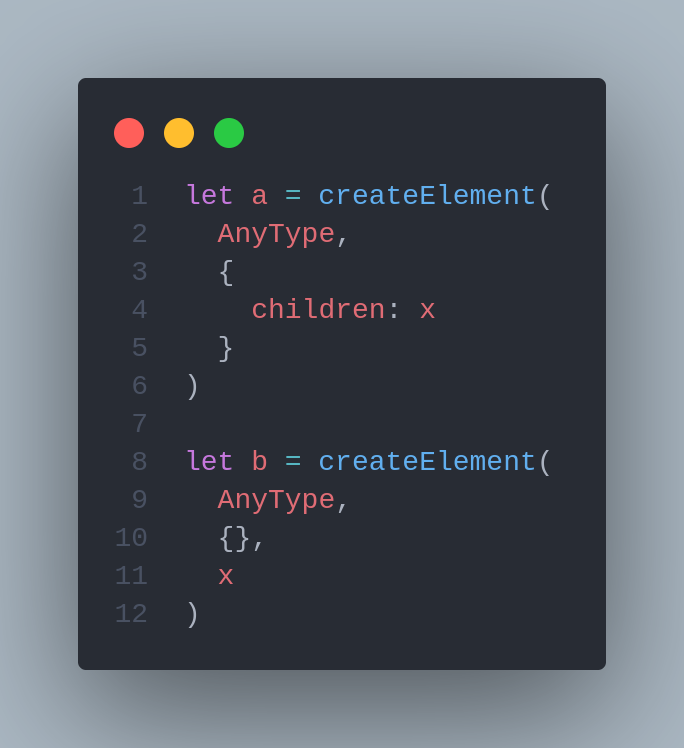
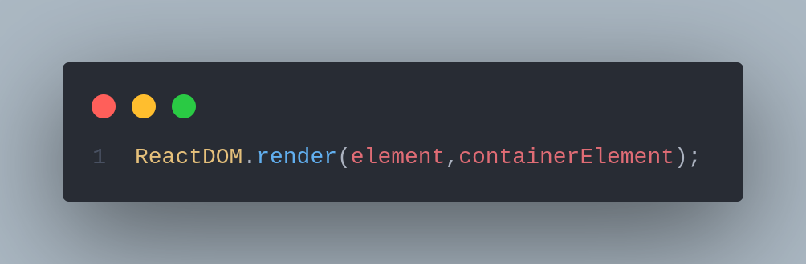

# 🆗 Basic view on React core API's

In this section we will try to understand raw **React API,** how we implement them ,what do they do and how are they different from just generating **DOM** Nodes with **Vanilla JavaScript.**

In the previous section we saw how to create **DOM** elements, how we append them to the **DOM** tree so we can see our element.

```jsx
...
  <body>
    <div id="root"></div>
    <script type="module">
    const rootElement = document.getElementById('root')

      // We always need to append the root element to the document
      document.body.append(rootElement);
    </script>
  </body>
...
```

**React** abstracts away **the imperative browser API** from you to give you a much more **declarative API** to work with.

> Learn more about the difference between those two concepts here: [Imperative vs Declarative Programming](https://tylermcginnis.com/imperative-vs-declarative-programming/)

With that in mind, you need two JavaScript files to write React applications for the web:

* React: responsible for creating React elements (kinda like `document.createElement()`)
* ReactDOM: responsible for rendering React elements to the DOM (kinda like `rootElement.append()`)

Let's convert our file to use React! using just raw React APIs here.

In modern applications you'll get **React** and **React DOM** files from a "package registry" like [npm](https://npmjs.com) ([react](https://npm.im/react) and [react-dom](https://npm.im/react-dom)).or even use project builder like:


[build-tool-choice-for-mvp-projects.md](../react-ecosystem/build-tool-choice-for-mvp-projects.md)


But we will use [https://unpkg.com/](https://unpkg.com). It's **CDN** (global content delivery network) that will allow us ready-to-use script files in regular script tags so you don't have to bother installing them.&#x20;

```jsx
 ...
   <body>
    <div id="root"></div>
    <script src="https://unpkg.com/react@17.0.0/umd/react.development.js"></script>
    <script src="https://unpkg.com/react-dom@17.0.0/umd/react-dom.development.js"></script>
    <script type="module">
     const rootElement = document.getElementById('root')

      // We always need to append the root element to the document
      document.body.append(rootElement);
    </script>
  </body>
...
```

That's it. We have `React` and `ReactDOM` as global variable that we can use in our code

## React.createElement() <a href="#createelement" id="createelement"></a>

**Syntax:**

.png>)



`React.createElement()` takes three arguments. They are:

* **type:**  The type argument can be either a **HTML** element tag name string (such as `'div'` or `'span'`), a [React component](https://reactjs.org/docs/components-and-props.html) type (a class or a function), or a [React fragment](https://reactjs.org/docs/react-api.html#reactfragment) type.
* **props:** n object containing properties ('**props**' in **React** terms) that get passed to the component. Since we're just getting started with **React**, we won't use these just yet — but be aware that the second options serves this purpose.
* **children:** the last argument is the children of that component. This can be a quoted **string** in which case the content will be interpreted as text. However, we can also pass in a reference to another component, allowing us to nest elements and components within each other&#x20;


**The third and subsqeuent arguments to `React.createElement()` are always added to the `props` as `children` — regardless of the type.**


So if you create an element with a custom type and children, you can access those children on its `props`.

In fact, these two `createElement()` calls are equivalent:



If we want one child for our element we can provide it within the **props** like the example below

```jsx
 // Children as prop
 const element = React.createElement('div', {
      className: 'container',
      children: 'Hello World',
    })
 // children as createElement THird argument   
 const element = React.createElement('div', {className: 'container'},'Hello World',)

```

But if we want to add multiple children then we can only use the third argument

```jsx
const title = React.createElement('h1', {}, 'My First React Code');
const paragraph = React.createElement('p', {}, 'Writing some more HTML. Cool stuff!');
const container = React.createElement('div', {}, [title, paragraph]);

```

#### Children's children <a href="#your-childrens-children" id="your-childrens-children"></a>

We can nest children as much as we want. We also don't need to store our elements in variables before using them, we can declare them inline as well (though the downside of this is less readable code):

```jsx
import React from 'react';
import ReactDOM from 'react-dom';

const list =
  React.createElement('div', {},
    React.createElement('h1', {}, 'My favorite fruit'),
    React.createElement('ul', {},
      [
        React.createElement('li', {}, 'orange'),
        React.createElement('li', {}, 'apple'),
        React.createElement('li', {}, 'Banana')
      ]
    )
  );
```

## ReactDOM.render() <a href="#createelement" id="createelement"></a>


**One important thing to know about React is that it supports multiple platforms (for example, native, web, VR). Each of these platforms has its own code necessary for interacting with that platform, and then there's shared code between the platforms.**


**Syntax:**





`ReactDOM.render()` takes two arguments:

* **element:** The element that needs to be rendered in the DOM.
* **containerElement:** Where to render in the DOM.

**React** implements a browser-independent **DOM** system for performance and cross-browser compatibility and render it using ReactDOM().


**The React Element objects that `React.createElement()` returns are just plain old JavaScript objects that describe the DOM nodes that you’d like `ReactDOM.render()` to create. They’re **_**not**_** DOM nodes, and **_**not**_** added to the document. They’re just objects.**


`ReactDOM()`will create **DOM** node and append or render our react app into a specific element that's that will behave as our app root

Let's see how our code will be using these two script files&#x20;

```jsx
 ...
   <body>
    <div id="root"></div>
    <script src="https://unpkg.com/react@17.0.0/umd/react.development.js"></script>
    <script src="https://unpkg.com/react-dom@17.0.0/umd/react-dom.development.js"></script>
    <script type="module">
    
    const element = React.createElement('div', {
      className: 'container',
      children: 'Hello World',
    })

    ReactDOM.render(element, document.getElementById('root'));
    </script>
  </body>
...
```

## References and articles :






