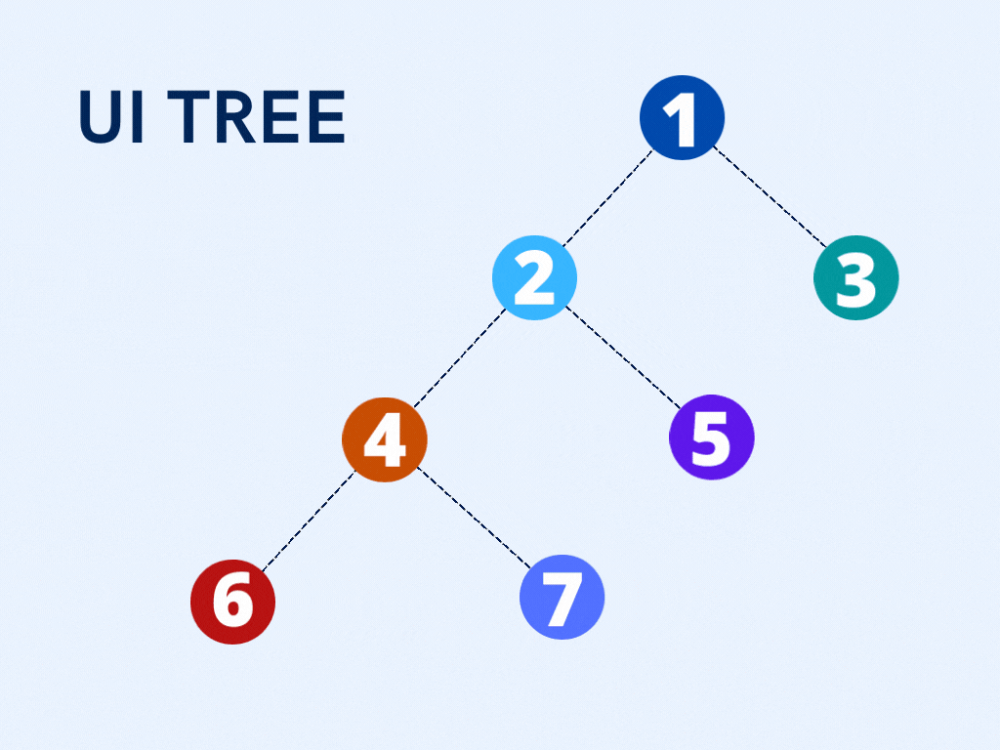

# 🏁 React Props and styling

## Props



Every React element has a `props` object. For elements representing **HTML** tags, this is just an object containing [DOM properties](https://developer.mozilla.org/en-US/docs/Web/API/Element#Properties).

Props stand for Properties. They are the read-only components which work similar to the HTML attributes. Prop is a way of passing data from parent to child component.

Think of props as arguments to a function. React components are functions which return JSX (or more generally something that's render-able like React elements, `null`, a string, etc.). Typically, when you have a piece of code that you would like to reuse, you can place that code into a function and any dynamic values that code used before can be accepted as arguments (for example `const result = 2 + 3` could be extracted to a function and accept arguments like so `const result = add(2, 3)`).


**NOTE: Props can be anything.  they can also be (and often are) strings, arrays, objects, functions, etc.**


As we already know, the react components arrange the UI in the form of a tree where the parent component becomes the root and child components become branches and sub-branches. Now suppose parent component wants to send data to one of its deeply nested components. Let us say from component 1 you need to send a property to component 6. How will you do that?



You cannot pass down a property directly to the target component. This is because React follows the rule where properties have to flow down from a parent component to an _immediate_ child component. This means you can’t skip a layer of child components when sending a property and the child components can’t send property back up to a parent as well. You can have default props in case a parent component doesn’t pass down props so that they are still set. This is why React has one-way data binding.

For example, if you want to render this **HTML** using `ReactDOM.render()`:

```jsx
<a id="home" href="http://lsxs.me/home">Visual Systems</a>
```

Then you’ll need to pass in an element whose `props` contain one entry for each of the `<a>` tag’s attributes:

```jsx
ReactDOM.render(
  React.createElement(
    'a',
    {
      id: 'home',
      href: 'http://lsxs.me/home',
    },
    'Visual Systems',
  ),
  document.getElementById('root')
)

```

Simple, right? There’s just one problem:

_Not all HTML attributes map directly to props._

### Prop naming <a href="#prop-naming" id="prop-naming"></a>

When creating React elements, your `props` need to be named after DOM properties — _not **HTML** attributes_. If you’re familiar with the DOM, this shouldn’t be a problem. If not, check out the article [HTML attributes vs. DOM properties](https://frontarm.com/articles/html-vs-dom-attributes/).

There’s a few of these naming differences you’ll come across rather frequently:

* Instead of **`class`**, you must use the **`className`** prop to set CSS classes
* Instead of a **`for`** attribute on your `<label>` elements, you must use a **`htmlFor`** prop
* Instead of passing a string for **`style`**, you must use an object with camelCased names
* Instead of **`tabindex`**, you’ll need to use a **`tabIndex`** prop (note the capitalization)

Remembering these differences can be a bit of a pain. But unless you’re building rockets or medical devices, trial and error probably won’t hurt. And as a bonus, memorizing these differences will help you even outside of the React ecosystem!

## Styling <a href="#styling" id="styling"></a>



Styling a React element is as simple as passing in `className` and/or `style` props.

But _which one should you use?_

Actually, _either is fine_. There are times you can’t beat the convenience of adding a short `style` prop, and there are times when you’ll use `className` to access the extra power provided by CSS.

#### **Limitations of style prop**

If you want to use selectors, including pseudo-selectors like `:hover`, then you’ll need to use `className`.

```jsx
<!DOCTYPE html>
<html lang="en">
  <head>
    <meta charset="UTF-8" />
    <meta http-equiv="X-UA-Compatible" content="IE=edge" />
    <meta name="viewport" content="width=device-width, initial-scale=1.0" />
    <title>Document</title>
    /* just some indicative styling */
    <style>
      .blue-border {
        border: 3px solid blue;
      }

      .blue-border:hover {
        border-style: dotted;
      }
    </style>
  </head>
  <body>
    <script src="https://unpkg.com/react@17.0.0/umd/react.development.js"></script>
    <script src="https://unpkg.com/react-dom@17.0.0/umd/react-dom.development.js"></script>
    <script src="https://unpkg.com/@babel/standalone@7.12.4/babel.js"></script>
    <script type="text/babel">
      let createElement = React.createElement;

      const child = createElement('div', {
        // The `style` prop accepts an object of styles
        style: {
          width: '100px',
          height: '100px',
          backgroundColor: 'aqua',
          padding: '10px',
        },
      });

      const container = createElement(
        'div',
        {
          // The `className` prop set's the element's CSS class.
          // The `blue-border` class is defined in styles.css.
          className: 'blue-border',
        },

        // The remaining arguments list the element's children
        child,
        child
      );

      ReactDOM.render(container, document.getElementById('root'));
    </script>
  </body>
</html>
```

And in JSX&#x20;

```jsx
<!DOCTYPE html>
<html lang="en">
  <head>
    <meta charset="UTF-8" />
    <meta http-equiv="X-UA-Compatible" content="IE=edge" />
    <meta name="viewport" content="width=device-width, initial-scale=1.0" />
    <title>Document</title>
    /* just some indicative styling */
    <style>
      .blue-border {
        border: 3px solid blue;
      }

      .blue-border:hover {
        border-style: dotted;
      }
    </style>
  </head>
  <body>
    <script src="https://unpkg.com/react@17.0.0/umd/react.development.js"></script>
    <script src="https://unpkg.com/react-dom@17.0.0/umd/react-dom.development.js"></script>
    <script src="https://unpkg.com/@babel/standalone@7.12.4/babel.js"></script>
    <script type="text/babel">
    
      const child = <div style={{ width: '100px', height: '100px', backgroundColor: 'aqua', padding: '10px' }}></div>;
      const Container = (
        <div className="blue-border">
          {child}
          {child}
        </div>
      );

      ReactDOM.render(Container, document.getElementById('root'));
    </script>
  </body>
</html>
```

## References and articles :&#x20;








