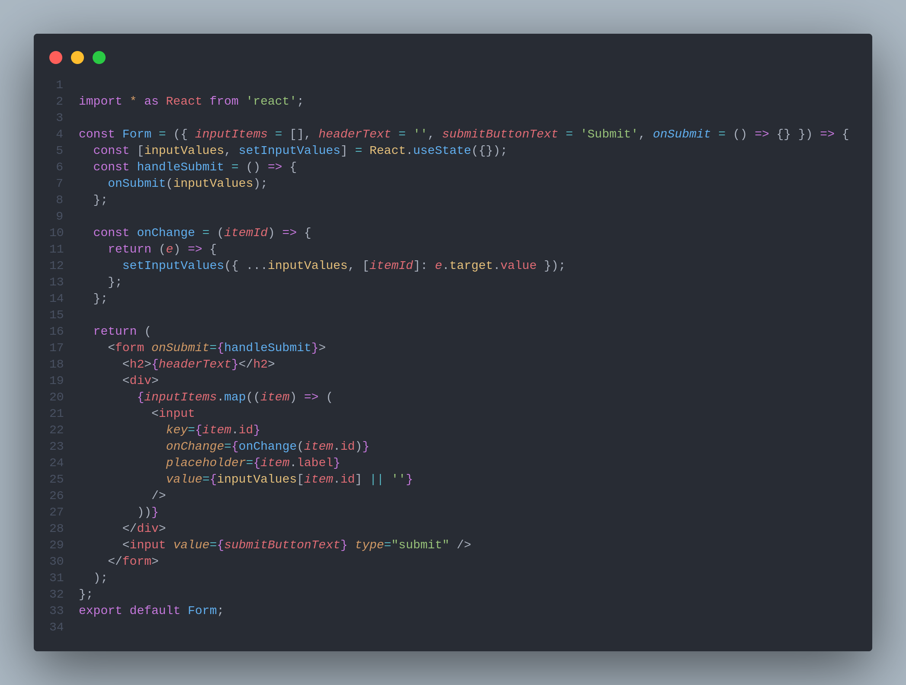
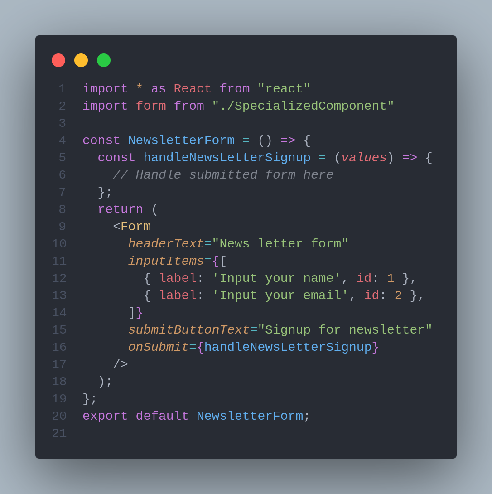
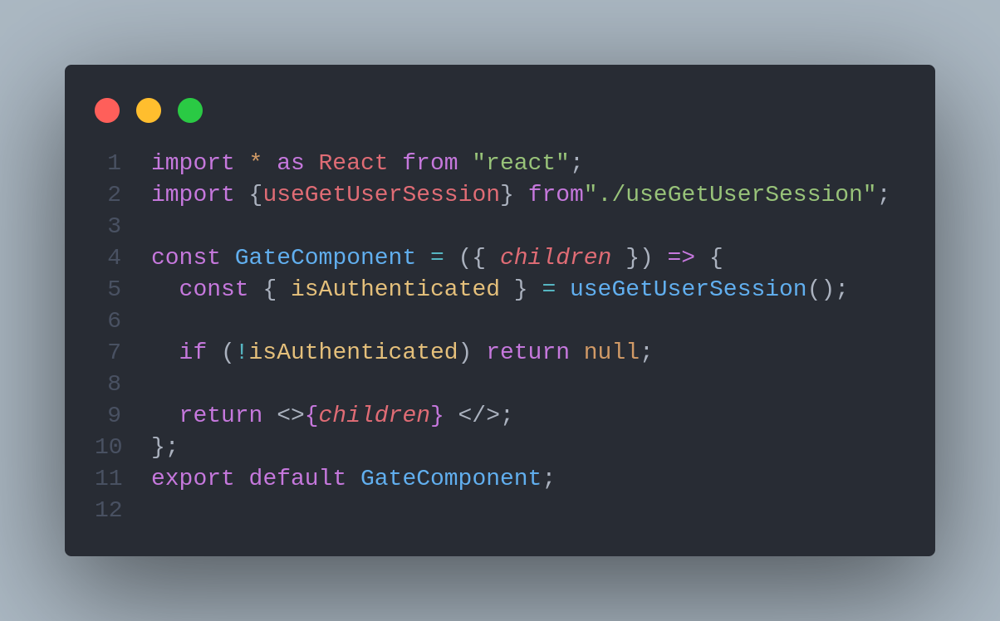
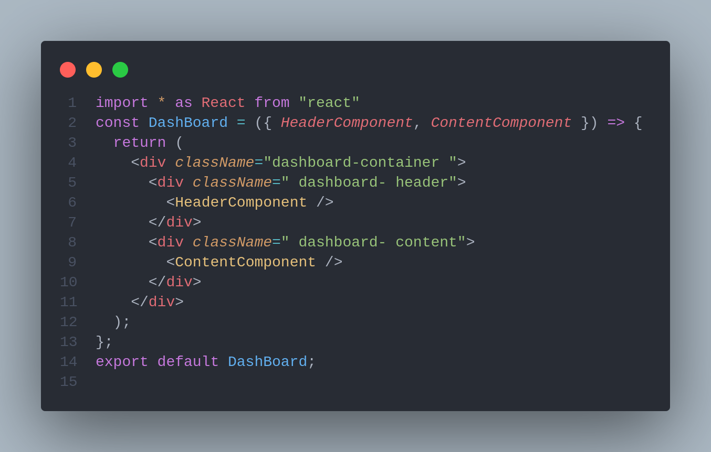

# 🏁 React Components Composition Guidelines

> One of the many great parts of React is how it makes you think about apps as you build them.

This document is made to explain how you should extract and define your components at a structural level when you're starting a new development or a refactor.

We highly recommend you to go to :





Component composition is a fundamental concept in React that must be learned in order to become a competent React developer. Inheritance and Context are frequently used by newer React developers to solve problems that could be solved more elegantly using composition.

Let's go over the fundamental principles of composition in React and brush up on our fundamentals.

### Overview of Component composition <a href="#overview-of-component-composition" id="overview-of-component-composition"></a>

To put it simply, component composition is the process of layering more complex components on top of simpler ones. There are two approaches to take:

* Specialized components
* Container components

Let’s cover these two approaches in more detail.

## Specialized component <a href="#specialized-component" id="specialized-component"></a>

Specialized components differ from generic components in that they are more opinionated. In other words, specialized components are typically non-reusable versions of generic components that have been customized for a specific use case.

We make specialized components by rendering generic ones and configuring the props to our specific use case.

Let's look at an example where we use a generic form component to create a newsletter sign-up form.

\
We will start with the generic form:



`Form` is a generic component used to build different forms throughout your app. It’s versatile and lets you configure the inputs for your form, the header, and the submit button.

Now, we will create the specialized `NewsletterForm` component on top of our `Form`:



Identifying patterns that you use frequently throughout your app and converting them into generic reusable components is a valuable skill to learn.

Once you've established a solid foundation of generic components, building specialized ones on top of them becomes much easier and faster. That is why including a UI component library in your new project is always a good idea.

## Container component <a href="#container-component" id="container-component"></a>

Without knowing its children ahead of time, the container component provides certain functionality. This type of component typically includes a children prop that allows you to pass any arbitrary content. Sidebars and dialogs are good examples of container components.

The container component is a versatile and adaptable pattern. A gate component that checks the user's authentication status before rendering its children is an example I frequently use in my applications.

Now, let’s see this pattern in action and create a simple version of the gating component:



### Container with multiple child props <a href="#container-with-multiple-child-props" id="container-with-multiple-child-props"></a>

In some cases, you may require container components with multiple injection points for your custom content.

A hypothetical **Dashboard** component that accepts header and content components is one example.



When you need to create a container with multiple "holes," you can deviate from the children prop pattern and use custom props for your injected content.

### Why composition is important <a href="#why-composition-is-important" id="why-composition-is-important"></a>

You should be able to see by now that component composition is extremely useful when working with React. Still, here are the main benefits of using component composition:

* When you build your components on top of generic ones, you end up with fewer components that feel like a black box. This, in turn, will improve the transparency and readability of your code.
* You can often avoid prop drilling without Context or Redux by using intelligent component composition. When you believe you need Context to pass props, you should rethink your component composition.
* You will gradually accumulate a component toolbox, which will increase the velocity of your development. Developing new components will become much more efficient.

## Tips and tricks

Always begin by highlighting and identifying the composition of the top-level App component as well as the composition of global layers such as pages, global layers (such as Headers, Sidebars, Layouts, Footer), and so on...







### Shared components definition roadmap&#x20;

Beginning with your base material (**mockups/wireframes, etc..)**, examine all the elements, look at the current data the page is requesting, and list all data involved.&#x20;

Reusable components are often agnostic. They don’t know what they render, neither hold any specific logic, they just render.



* If some wrappers are business logic components, simply write what this logic is supposed to accomplish. This includes intelligent components with logic.
* &#x20;Props should be processed and standardised. Examine the similar components by summarizing the common props, listing them, and attempting to create a consistent experience across all components. (For example, if you have two components that take a string and display it as a title, one prop is name `title` and the other `label`, use only one of them across both components.)

```tsx
// from
<Box title="some text" />
<Card label="some text" />

// to 
<Box title="some text" />
<Card title="some text" />

```

### Separate constants and helpers into different files <a href="#00fa" id="00fa"></a>

My objective when writing React components is to keep each file under 200 lines. This means moving `helper` functions into a separate `component.utils.ts` file and constants into a `component.constants.ts` file to make the component smaller and easier to read.

### Avoid nesting render functions <a href="#83bd" id="83bd"></a>

This is one of my least favorite practices to come across in the code I review. Don't create a function that lives inside another component when extracting markup and logic from a component. Nesting components is almost always a bad idea because it makes code difficult to read.

Move the new component to its own files and rely on props rather than using a globally nested state.


```jsx
// Don't write nested render functions
const Menu = () => {
  
  const MenuItem = () => {
    return <button>...</button>
  }
  
  return <MenuItem />
}
```



```jsx
// Extract to its own component
import MenuItem from '../components/MenuItem'

const Menu = () => {
  return <div> <MenuItem/> </div>
}
```


## References and articles :
























