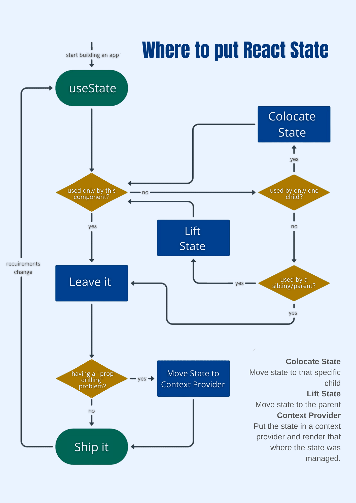

# 🆗 Lifting State Up

## The state sharing problem

In some cases, it may be interesting to communicate or synchronize the state of a component with another component which is not a descendant of this first component (the set of components forms a graph). They can be for example at the same level of hierarchy in the component tree.

In React, the primary way to communicate data from one component to another is through the properties of those subcomponents. We thus speak of **Top-Down or Unidirectional Data Flow** .

As a reminder, it is not possible to modify its own properties. Moreover, the State is local to the component. We can obviously communicate the State in properties of its sub-components but once again it is a Top-Down approach.

### Solution: Lifting State Up

In order to solve this problem, the approach is to communicate the state of the components to their closest common ancestor. We then speak of **Lifting State Up** (raising the state).

It suffices for this that a component gives in properties to the descending component a callback function so that the latter can go up its state.



## References and articles :














