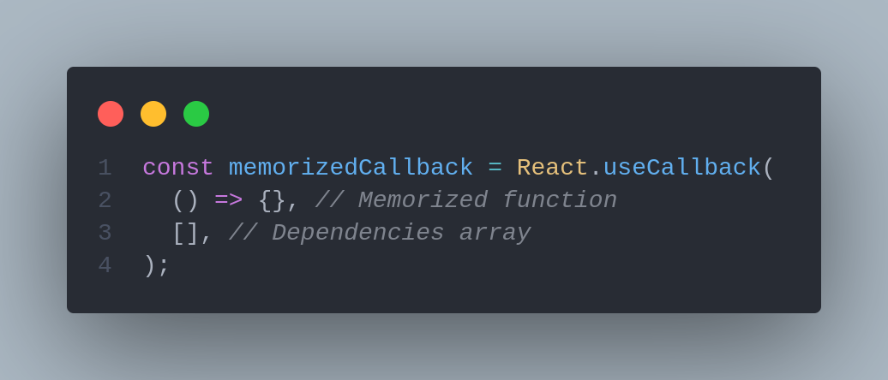

# 🏁 useCallback


The goal of **useCallback** is to avoid unnecessary re-renderings; it accepts two values: a memorized function and an array of dependencies that will update this function whenever any of the values change.



When a function is wrapped with **useCallback**, React saves a reference to it. To reduce rendering time, pass this reference as a property to new components.

### Purpose of useCallback

```jsx
function MyComponent() {
  // handleClick is re-created on each render
  const handleClick = () => {
    console.log('Clicked!');
  };
 ...
}
```

On each rendering of MyComponent, **handleClick** is a different function object.

But in some cases you need to maintain a single function instance between renderings:

1. A functional component wrapped inside `React.memo()` accepts a function object prop
2. When the function object is a dependency to other hooks, e.g. `useEffect(..., [callback])`

This is where **useCallback**(callbackFun, deps) comes in handy: Given the same deps, the hook returns (aka **memoizes**) the function instance between renderings:

```jsx
import { useCallback } from 'react';

function MyComponent() {
  // handleClick is the same function object
  const handleClick = useCallback(() => {
    console.log('Clicked!');
  }, []);
 ...
}
```

### A use case where we should adopt useCallback() <a href="#3-a-good-use-case" id="3-a-good-use-case"></a>

Imagine you have a component that renders a big list of items:

```jsx
import useSearch from './useSearch';

function MyBigList({ term, onItemClick }) {
  const items = useSearch(term);
  
  const map = (item) => <div onClick={onItemClick}>{item}</div>;
  
  return <div>{items.map(map)}</div>;
}
export default React.memo(MyBigList)
```

The list could be lengthy, possibly containing hundreds of items. You wrap it in **`React.memo`** to avoid unnecessary list re-renderings ().

The parent component of `MyBigList` provides a handler function to know when an item is clicked:

```jsx
import * as React from 'react';

export function MyParent({ term }) {
  const onItemClick = React.useCallback(
    (event) => {
      console.log('You clicked ', event.currentTarget);
    },
    [term],
  );
  return <MyBigList term={term} onItemClick={onItemClick} />;
}

```

When `MyParent` component re-renders, `onItemClick` function object remains the same and doesn't break the memoization of `MyBigList`.

That was a good use case of `useCallback()`.

### A use case where we shouldn't adopt useCallback() <a href="#3-a-good-use-case" id="3-a-good-use-case"></a>

Let's look at another example:

```jsx
import * as React from 'react';

function MyComponent() {
  // Contrived use of `useCallback()`
  const handleClick = useCallback(() => {
    // handle the click event
  }, []);
  return <MyChild onClick={handleClick} />;
}
function MyChild({ onClick }) {
  return <button onClick={onClick}>I am a child</button>;
}
```

Does it make sense to apply `useCallback()`? Most likely not because `<MyChild>` component is light and its re-rendering doesn't create performance issues.

Don't forget that `useCallback()` hook is called every time `MyComponent` renders. Even `useCallback()` returning the same function object, still, the inline function is re-created on every re-rendering (`useCallback()` just skips it).

By using `useCallback()` you also increased code complexity. You have to keep the `deps` of `useCallback(..., deps)` in sync with what you're using inside the memoized callback.

In conclusion, _the optimization costs more than not having the optimization_.

Simply _accept_ that rendering creates new function objects:

```jsx
import * as React from 'react';
function MyComponent() {
  const handleClick = () => {
    // handle the click event
  };
  return <MyChild onClick={handleClick} />;
}
function MyChild({ onClick }) {
  return <button onClick={onClick}>I am a child</button>;
}

```

### Working with `useCallback` vs. `useMemo` in React

The `useCallback` and `useMemo` functions appear similar on the surface. However, there are particular use cases for each.

Wrap functions with `useCallback` when:

* Wrapping a functional component in `React.memo()` that accepts your method as a property
* Passing a function as a dependency to other hooks

Utilize `useMemo`:

* For functions whose inputs change gradually
* When data values are not so large that they pose a potential memory issue
* When parameters are not so small that the cost of comparisons outweighs the use of the wrapper

A callback works well when code would otherwise be recompiled with every call. Memorizing results can help decrease the cost of repeatedly calling functions when the inputs change gradually over time. On the other hand, in the trading example, we may not want to memorize results for a constantly changing order book.

### `useCallback` and `useMemo` anti-patterns

It can be tempting to think you can make use of `useCallback` or `useMemo` [for every function](https://kentcdodds.com/blog/usememo-and-usecallback) … but this is not the case. There is overhead associated with wrapping functions. Each call requires extra work to unravel your function call and decide how to proceed.
