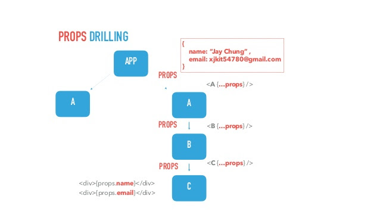
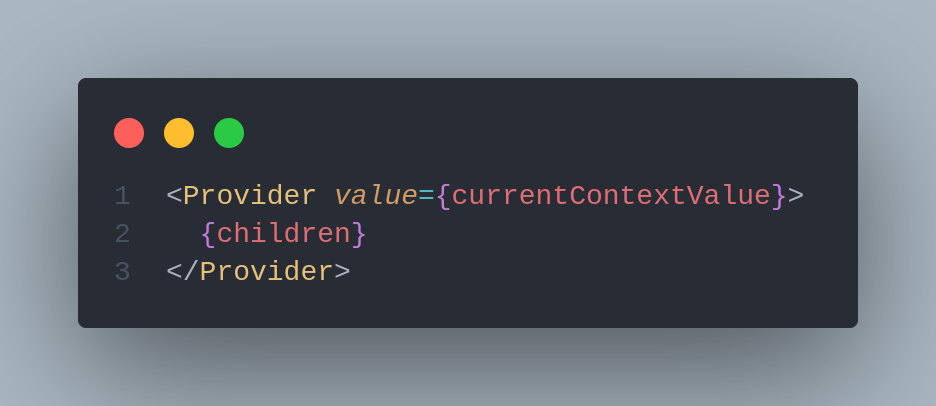
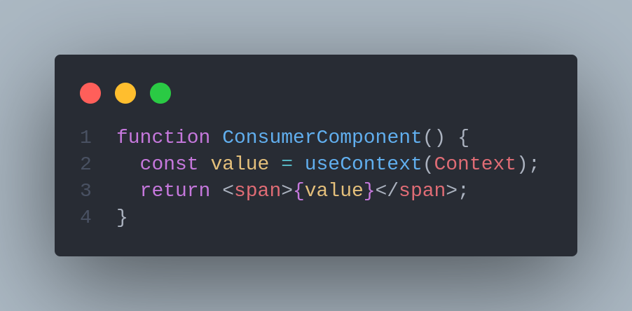
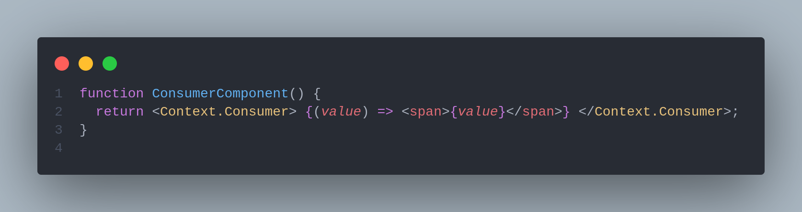
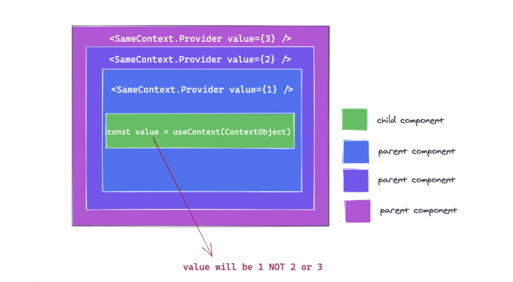
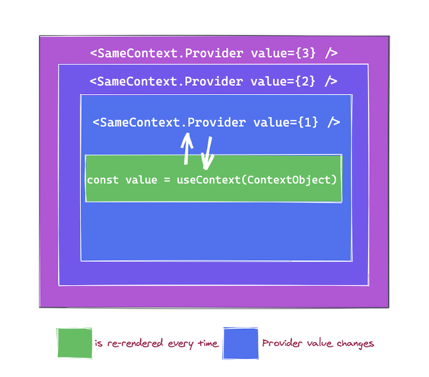
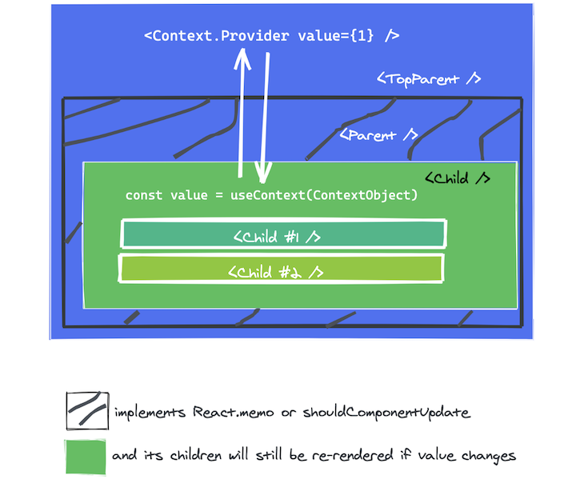
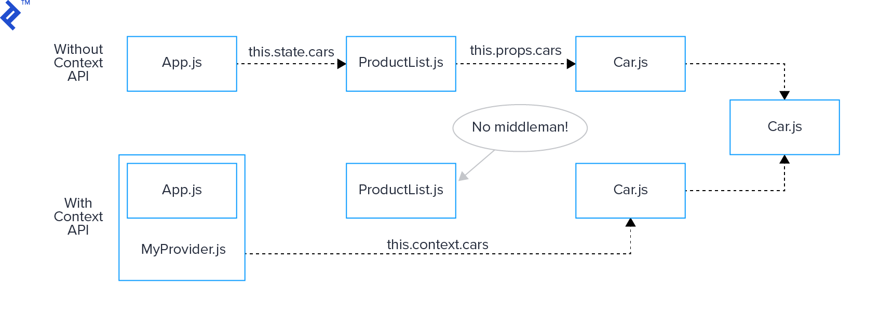

# ⚠ useContext

## Introduction to prop drilling

There has always been a need to share data with different components when working with React. This can be achieved in the most basic way using prop drilling. Prop drilling allows for unidirectional data sharing between components. The data passed or shared in the form of props.

Let’s consider the diagram below:



&#x20;

For the data in the A component to be accessed in the C component, it has to be passed down as prop to the B component, and then finally the C component. This is known as threading.

From the above explanation, you can understand the basics of what prop drilling is and why we need it.

## React Context <a href="#gettingstartedwithreactcontext" id="gettingstartedwithreactcontext"></a>



According to the React docs, Context provides a way to pass data through the component tree from parent to child components, without having to pass props down manually at each level.

Each component in Context is context-aware. Essentially, instead of passing props down through every single component on the tree, the components in need of a prop can simply ask for it, without needing intermediary helper components that only help relay the prop.

### API <a href="#api" id="api"></a>

#### `React.createContext` <a href="#reactcreatecontext" id="reactcreatecontext"></a>

The `createContext` method is used to create a Context object to which components can subscribe. These components are able to get the context value from the closest matching Provider above them in the tree.

>)

Components are usually wrapped in a Provider in order to get their context value. However, when there’s no matching Provider above a component in the tree, the component will get its context from the default argument `initialContext` in the `createContext` method. This is especially useful when testing components in isolation.

#### `Context.Provider` <a href="#contextprovider" id="contextprovider"></a>

The `React.createContext` method will return a Provider component when it is called. Providers are React components from Context objects that allow other components to access those context values and subscribe to their changes.

>)

The Provider component accepts a `value` prop, which can then be accessed by its consuming child components. A Provider can have multiple child components or consumers.



Components will use the default context value from the `createContext` method when they have no matching parent Provider. However, once a Provider is available, even if its `value` prop is `undefined`, its child components or consumers will use its value.

Whenever a Provider’s `value` prop changes, its subscribed consumers will re-render.

**Consuming the context**

Consuming the context can be performed in 2 ways.

The first way, the one I recommend, is to use the `useContext(Context)` React hook:



The hook returns the value of the context: `value = useContext(Context)`. The hook also makes sure to re-render the component when the context value changes.

The second way is by using a render function supplied as a child to `Context.Consumer` special component available on the context instance:



Again, in case if the context value changes, `<Context.Consumer>` will re-render its render function.

`useContext` is invoked with a context object (the result of calling `React.createContext`), and it returns the current value for that context.

The value returned from `useContext` is determined by the value `prop` of the nearest `Provider` above the calling component in the tree.



Note that using the `useContext` Hook within a component implicitly subscribes to the nearest `Provider` in the component tree, i.e., when the `Provider` updates, this Hook will trigger a serenader with the latest value passed to that `Provider`.



Here’s an even more important point to remember. If the ancestor component uses `React.memo` or `shouldComponentUpdate`, a re-render will still happen starting at the component that calls `useContext`.



A component calling `useContext` will be re-rendered when the context value changes. If this is expensive, you may consider optimizing it by using [memoization](https://github.com/facebook/react/issues/15156#issuecomment-474590693).

Remember that `useContext` only lets you read the context and subscribe to its changes. You still need a context provider, i.e., `ContextObject.Provider`, above in the component tree to provide the value to be read by `useContext`.




You can have as many consumers as you want for a single context. If the context value changes (by changing the `value` prop of the provider `<Context.Provider value={value} />`), then all consumers are immediately notified and re-rendered.

If the consumer isn't wrapped inside the provider, but still tries to access the context value (using `useContext(Context)` or `<Context.Consumer>`), then the value of the context would be the default value argument supplied to `createContext(defaultValue)` factory function that had created the context.

### Use case: global user name <a href="#3-use-case-global-user-name" id="3-use-case-global-user-name"></a>

The simplest way to pass data from a parent to a child component is when the parent assigns props to its child component:

```jsx
function UserInfo({ userName }) {
  return <span>{userName}</span>;
}

function Application() {
  const userName = "John Smith";
  return <UserInfo userName={userName} />;
}

function UserInfo({ userName }) {
  return <span>{userName}</span>;
}
```

The parent component `<Application />` assigns `userName` data to its child component `<UserInfo name={userName} />` using the `userName` prop.

That's the usual way how data is passed using props. You can use this approach without problems.

The situation changes when `<UserInfo />` child component isn't a direct child of `<Application />` but is contained within multiple ancestors.

For example, let's say that `<Application />` component (the one having the global data `userName`) renders `<Layout />` component, which in turn renders `<Header />` component, which in turn finally renders `<UserInfo />` component (that'd like to access `userName`).

Here's how such a structuring would look:

{% embed url="https://codesandbox.io/embed/props-drilling-forked-sxvek3?fontsize=14&hidenavigation=1&module=%2Fsrc%2FApplication.js&theme=dark" %}

You can see the problem: because `<UserInfo />` component renders deep down in the tree, and all the parent components (`<Layout />` and `<Header />`) have to pass the `userName` prop.



React context is a possible solution. Let's see how to apply it in the next section.

#### 3.1 Context to the rescue <a href="#31-context-to-the-rescue" id="31-context-to-the-rescue"></a>

As a quick reminder, applying the React context requires 3 actors: the context, the provider extracted from the context, and the consumer.

Here's how the sample application would look when applying the context to it:

{% embed url="https://codesandbox.io/embed/react-context-example-forked-8nvoez?fontsize=14&hidenavigation=1&module=%2Fsrc%2FApplication.js&theme=dark" %}

Let's look into more detail what has been done.

First, `const UserContext = createContext('')` creates the context that's going to hold the user name information.

Second, inside the `<Application />` component, the application's child components are wrapped inside the user context provider: `<UserContext.Provider value={userName}>`. Note that the `value` prop of the provider component is important: this is how you set the value of the context.

Finally, `<UserInfo />` becomes the consumer of the context by using the built-in `useContext(UserContext)` hook. The hook is called with the context as an argument and returns the user name value.

`<Layout />` and `<Header />` intermediate components don't have to pass down the `userName` prop. That is the great benefit of the context: it removes the burden of passing down data through the intermediate components.

#### 3.2 When context changes <a href="#32-when-context-changes" id="32-when-context-changes"></a>

When the context value is changed by altering `value` prop of the context provider (`<Context.Provider value={value} />`), then all of its consumers are being notified and re-rendered.

For example, if I change the user name from `'John Smith'` to `'Smith, John Smith'`, then `<UserInfo />` consumer immediately re-renders to display the latest context value:

{% embed url="https://codesandbox.io/embed/react-context-example-change-forked-p6xsf7?fontsize=14&hidenavigation=1&module=%2Fsrc%2FApplication.js&theme=dark" %}

at first you'd see `'Maissen Ayed'` (context value) displayed on the screen. After 2 seconds, the context value changes to `'Ayed, Maissen Ayed"`, and correspondingly the screen is updated with the new value.

The consumer that renders the context value on the screen, re-renders when the context value changes.

#### 4. Updating the context <a href="#4-updating-the-context" id="4-updating-the-context"></a>

The React Context API is stateless by default and doesn't provide a dedicated method to update the context value from consumer components.

But this can be easily implemented by integrating a state management mechanism (like `useState()` or `useReducer()` hooks), and providing an update function right in the context next to the value itself.

In the following example, `<Application />` component uses `useState()` hook to manage the context value.



`<UserNameInput />` consumer reads the context value, from where `userName` and `setUserName` are extracted. The consumer then can update the context value by invoking the update function `setUserName(newContextValue)`.

`<UserInfo />` is another consumer of the context. When `<UserNameInput />` updates the context, this component is updated too.

Note that `<Application />` memoizes the context value. Memoization keeps the context value object the same as long as `userName` is the same, preventing re-rendering of consumers every time the `<Application />` re-renders.

Otherwise, without memoization, `const value = { userName, setUserName }` would create different object instances during re-rendering of `<Application />`, triggering re-rendering in context consumers.&#x20;

### Global shared state with React Context

Another use case for React Context is using it as a global state mechanism, like we have in between `TopNav` and `Profile`. Updating the `username` in `Profile` immediately updates the shared state in `UserProvider`, providing a mechanism for global state management.

As with prop drilling, there can be some performance drain when using Context. Whenever it renders, its child components also render. One way to minimize rendering is to keep Context as close to where it’s being used as possible, like we’ve done with `UserProvider`. Although we could position it higher up in the component tree, it would be less effective.

### What the React Context API is used for <a href="#whatthereactcontextapiisusedfor" id="whatthereactcontextapiisusedfor"></a>

With React Context, we can pass data deeply. While some developers may want to use Context as a global state management solution, doing so is tricky. While React Context is native and simple, it isn’t a dedicated state management tool like Redux, and it doesn’t come with sensible defaults.

If you decide to use React Context at all, you should be aware of its potential for performance drain. You can very easily get carried away and add too many components where they aren’t needed. To prevent re-rendering, be sure to place contexts correctly only in the components that require them.

The main idea of using the context is to allow your components to access some global data and re-render when that global data is changed. Context solves the props drilling problem: when you have to pass down props from parents to children.

You can hold inside the context:

* global state
* theme
* application configuration
* authenticated user name
* user settings
* preferred language
* a collection of services

On the other side, you should think carefully before deciding to use context in your application.

First, integrating the context adds complexity. Creating the context, wrapping everything in the provider, using the `useContext()` in every consumer — this increases complexity.

Secondly, adding context makes it more difficult to unit test the components. During unit testing, you would have to wrap the consumer components into a context provider. Including the components that are indirectly affected by the context — the ancestors of context consumers!

### Redux vs. the React Context API <a href="#reduxvsthereactcontextapi" id="reduxvsthereactcontextapi"></a>

Does React Context replace Redux? The short answer is no, it doesn’t. As we’ve seen, Context and Redux are two different tools, and comparison often arises from misconceptions about what each tool is designed for.

Although Context can be orchestrated to act as a state management tool, it wasn’t designed for that purpose, so you’d have to do put in extra effort to make it work. There are already a lot of state management tools that work well and will ease your troubles.

In my experience with Redux, it can be relatively complex to achieve something that is easier to solve today with Context. Keep in mind, prop drilling and global state management is where Redux and Context’s paths cross. Redux has more functionality in this are.

Ultimately, Redux and Context should be considered complementary tools that work together instead of alternatives. My recommendation is to use Redux for complex global state management and Context for prop drilling.

You can find more from the creator of redux him self&#x20;



## References and articles :








