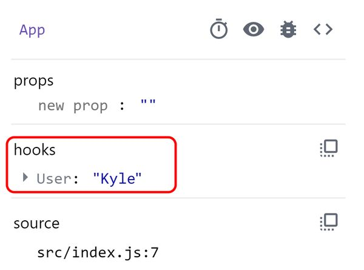
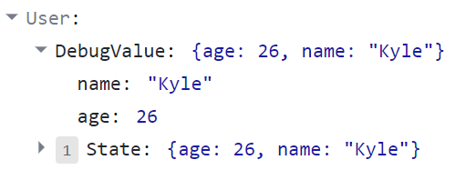
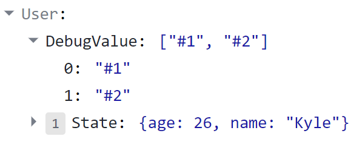

# ⚠ useDebugValue

### `useDebugValue` <a href="#usedebugvalue" id="usedebugvalue"></a>

The `useDebugValue` hook is simply used to print out debug information for custom hooks. This is incredibly useful if you are creating a library for others to use since they can easily see information about your hook, but it also is useful for your own hooks since you can quickly see detailed information about your hooks.

This debug information is displayed within the React dev tools. These tools are part of an extension you can download in any major browser and then access as a tab within the dev tools of your browser just the same as you can access the console/network information.

Let's look at a quick example.

```js
export default function useUser() {
  const [user, setUser] = useState(getUser())

  useDebugValue(user == null ? 'No User' : user.name)

  return [user, setUser]
}
```

In this custom `useUser` hook we have a `useDebugValue` hook that takes a string as its only argument. Passing a single string to `useDebugValue` is by far the most common way to use this hook and when you do you will see something interesting in the React dev tools if you click on a component that utilizes this hook. On the right side of the screen you will see a section labeled `hooks` and inside the section you will see the `User` hook and next to that you will see the debug information we passed to `useDebugValue`.



### Advanced Usage <a href="#advanced-usage" id="advanced-usage"></a>

Passing a label to `useDebugValue` is by far the most common way to use this hook, but you can actually pass whatever you want to the hook and even use multiple `useDebugValue` hooks. Here are some examples of what that looks like.

#### Using Non-String Parameters <a href="#using-non-string-parameters" id="using-non-string-parameters"></a>

```js
useDebugValue(user)
```




**When the hook is closed it will show a stringified label of the parameter if possible, but when you expand the hook for details you will see a `DebugValue` section that you can expand for more details on the object.**


#### Using Multiple `useDebugValue` Statements <a href="#using-multiple-usedebugvalue-statements" id="using-multiple-usedebugvalue-statements"></a>

```js
useDebugValue("#1")
useDebugValue("#2")

```



As you can see this works pretty much exactly the same as if you had just passed an array to `useDebugValue`. Internally, React just combines all the `useDebugValue` hooks into one array in the debug tools.

#### Performance Concerns <a href="#performance-concerns" id="performance-concerns"></a>

One thing most people worry about with adding debug code to their application is how it will slow down production. This is especially bothersome if the code for calculating the `useDebugValue` label is slow. Luckily, the React team thought of this which is why `useDebugValue` can take a second parameter which is a function that is only called when the hooks are actually inspected in the dev tools.

```js
useDebugValue(user, user => user.getNameSlowly())
```

In the above code we pass the user to `useDebugValue` as the first parameter and then as a second parameter we pass a function. This function will always take whatever you pass as the first parameter to `useDebugValue` as its argument and then whatever that function returns is displayed as the debug value label.

This means that the code to calculate the label is never actually run until the moment someone tries to inspect the hook with their dev tools. This is perfect since it will have no performance impact on your site, but can still provide valuable debug information.

\
