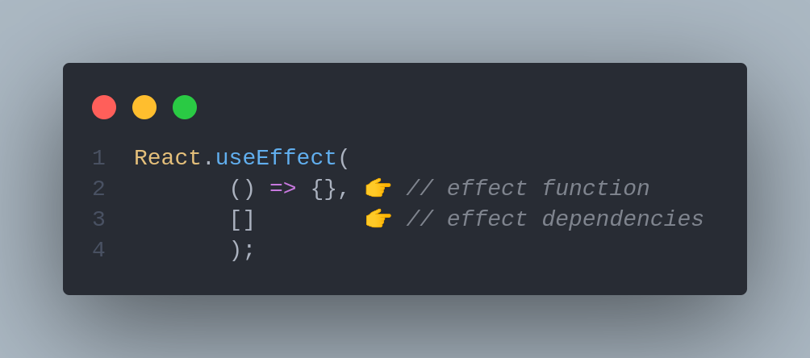
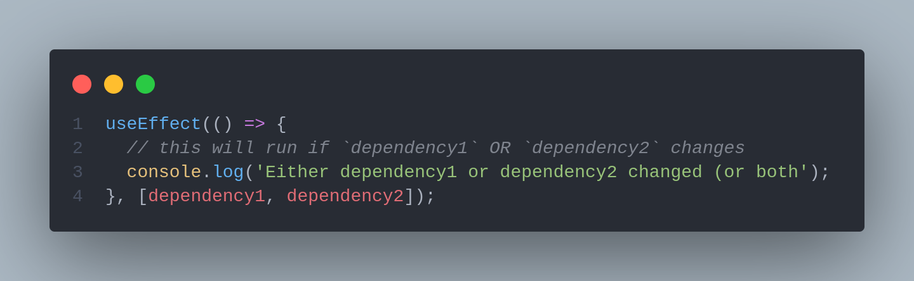
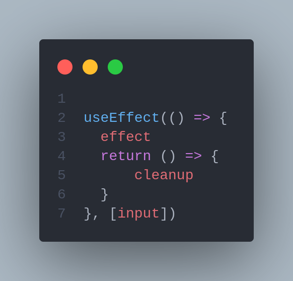
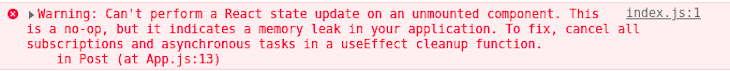

# ☢ useEffect

`React.useEffect` is a built-in hook that allows you to run some custom code after React renders (and re-renders) your component to the DOM. It accepts a callback function which React will call after the DOM has been rendered but before all of that let's dive deep into what is an effect

## What are effects

"Side Effect" is not a react-specific term. It is a general concept about behaviours of functions. A function is said to have side effect if it trys to modify anything outside its body. For example, if it modifies a global variable, then it is a side effect. If it makes a network call, it is a side effect as well.



Side effects are basically anything that affects something outside of the scope of the current function that’s being executed.&#x20;

## React side Effect

Sometimes, however, we need our components to reach outside this data-flow process and directly interact with other APIs. An action that impinges on the outside world in some way is called a _side effect_. Common side effects include the following:

* handling subscriptions with event listeners
* dealing with manual DOM changes.
* Logging messages to the console or other service
* Setting or getting values in local storage
* Fetching data or subscribing and unsubscribing to services

&#x20;[`useEffect`](https://reactjs.org/docs/hooks-reference.html#useeffect)  is a hook to let you  invoke side effects from within functional components,

The basic signature of `useEffect` is as follows:



Let's analyse this example

```jsx
import * as React from "react";

const BasicEffect = () => {
  const [counter, setCounter] = React.useState(0);
  const handleClick = () => setCounter((prev) => prev + 1);

  React.useEffect(() => {
    handleClick();
  });

  return (
    <div>
      <span> {`Counter is ${counter}`} </span>
    </div>
  );
};
```



As we can see the useEffect will force the component to rerender because useEffect is always invoked after each rerender so when the after the counter is updated useEffect will invoke  handleClick and we find our self in an infinite loop&#x20;

### Empty dependency array

It is also possible to add an empty dependency array. In this case, effects are only executed once; it is similar to the [`componentDidMount()`](https://reactjs.org/docs/react-component.html#componentdidmount) lifecycle method. (similar by not exactly the same)

```jsx
import * as React from "react";

const BasicEffect = () => {
  const [counter, setCounter] = React.useState(0);
  const handleClick = () => setCounter((prev) => prev + 1);

  React.useEffect(() => {
    handleClick();
  },[]);

  return (
    <div>
      <span> {`Counter is ${counter}`} </span>
    </div>
  );
};
```


**`useEffect` is passed an empty array, `[]`. Hence, the effect function will be called only on mount**


### Triggering Effect

#### Let's take this example

```jsx
import * as React from "react";

const BasicEffect = () => {
  const [counter, setCounter] = React.useState(0);
  const handleClick = () => setCounter((prev) => prev + 1);

  React.useEffect(() => {
    handleClick();
  },[count]);

  return (
    <div>
      <span> {`Counter is ${counter}`} </span>
    </div>
  );
};
```

We still have an infinite loop , but why is that&#x20;



The dependency array basically tells the hook to "only trigger when the dependency array changes". In the above example, it means "run the callback every time the `counter` variable changes".

If you have multiple elements in a dependency array, the hook will trigger if _any_ element of the dependency array changes.

### Skipping effects

```jsx
const ArrayDepMount = () => {
  const [randomNumber, setRandomNumber] = useState(0)
  const [effectLogs, setEffectLogs] = useState([])

  useEffect(
    () => {
      setEffectLogs(prevEffectLogs => [...prevEffectLogs, 'effect fn has been invoked'])
    },
    [randomNumber]
  )

  return (
    <div>
      <h1>{randomNumber}</h1>
      <button
        onClick={() => {
          setRandomNumber(Math.random())
        }}
      >
        Generate random number!
      </button>
      <div>
        {effectLogs.map((effect, index) => (
          <div key={index}>{'🍔'.repeat(index) + effect}</div>
        ))}
      </div>
    </div>
  )
}
```

Here we can see that the effect depends on the randomNumber state and it will only trigger if the randomNumber value has changed&#x20;


**If your effect depends on some state or prop value in scope, be sure to pass it as an array dependency to prevent stale values being accessed within the callback. If the referenced values change over time and are used in the callback, be sure to place them in the array dependency**


The React team recommends you use the [eslint-plugin-react-hooks](https://www.npmjs.com/package/eslint-plugin-react-hooks#installation) package. It warns when dependencies are specified incorrectly and suggests a fix.

#### The importance of the dependency array

&#x20;if you do not provide a dependency array, every scheduled `useEffect` is executed. This means that after every render cycle, every effect defined in the corresponding component is executed one after the other based on the positioning in the source code.

So the order of your effect definitions matter. In our case, our single `useEffect` statement is executed whenever one of the state variables change.

You have the ability to opt out from this behavior. This is managed with dependencies you provide as array entries. In these cases, React only executes the `useEffect` statement if at least one of the provided dependencies has changed since the previous run. In other words, with the dependency array, you make the execution dependent on certain conditions.

More often than not, this is what we want; we usually want to execute side effects after specific conditions, e.g., data has changed, a prop changed, or the user first sees our component. :arrow\_down:

### Multiple effects

Multiple `useEffect` calls can happen within a functional component, as shown below:

```jsx
const MultipleEffects = () => {
  // ⏬ 
  useEffect(() => {
    const clicked = () => console.log('window clicked')
    window.addEventListener('click', clicked)

    return () => {
      window.removeEventListener('click', clicked)
    }
  }, [])

  // ⏬  another useEffect hook 
  useEffect(() => {
    console.log("another useEffect call");
  })

  return <div>
    Check your console logs
  </div>
}
```

Note that `useEffect` calls can be skipped — i.e., not invoked on every render. This is done by passing a second array argument to the effect function.

## Cleaning up an effect <a href="#cleaningupaneffect" id="cleaningupaneffect"></a>

React’s `useEffect` cleanup function saves applications from unwanted behaviors like memory leaks by cleaning up effects. In doing so, we can optimize our application’s performance.

### What is the `useEffect` cleanup function?

Just like the name implies, the `useEffect` cleanup is a function that allows us to tidy up our code before our component unmounts. When our code runs and reruns for every render, `useEffect` also cleans up after itself using the cleanup function.

The `useEffect` Hook is built in a way that we can return a function inside it and this return function is where the cleanup happens. The cleanup function prevents memory leaks and removes some unnecessary and unwanted behaviors.

Note that you don’t update the state inside the return function either:



### Why is the `useEffect` cleanup function useful?

As stated previously, the `useEffect` cleanup function helps developers clean effects that prevent unwanted behaviors and optimizes application performance.

However, it is pertinent to note that the `useEffect` cleanup function does not only run when our component wants to unmount, it also runs right before the execution of the next scheduled effect.

In fact, after our effect executes, the next scheduled effect is usually based on the dependency array

Therefore, when our effect is dependent on our prop or anytime we set up something that persists, we then have a reason to call the cleanup function.

Let’s look at this scenario: imagine we get a fetch of a particular user through a user’s `id`, and, before the fetch completes, we change our mind and try to get another user. At this point, the prop, or in this case, the `id`, updates while the previous fetch request is still in progress.

It is then necessary for us to abort the fetch using the cleanup function so we don’t expose our application to a memory leak.

### When should we use the `useEffect` cleanup?

Let’s say we have a React component that fetches and renders data. If our component unmounts before our promise resolves, `useEffect` will try to update the state (on an unmounted component) and send an error that looks like this:



To fix this error, we use the cleanup function to resolve it.

According to React’s official documentation, “React performs the cleanup when the component unmounts. However… effects run for every render and not just once. This is why React also cleans up effects from the previous render before running the effects next time.”

The cleanup is commonly used to cancel all subscriptions made and cancel fetch requests.



## Usefull links






