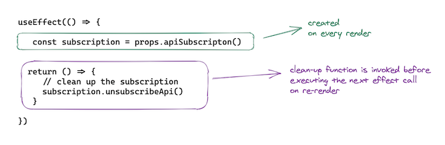
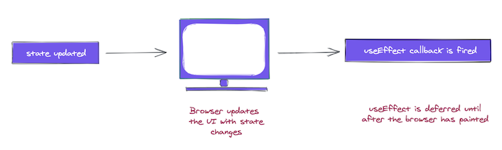

# useEffect

`React.useEffect` is a built-in hook that allows you to run some custom code after React renders (and re-renders) your component to the DOM. It accepts a callback function which React will call after the DOM has been rendered but before all of that let's dive deep into what is an effect

## What are effects

"Side Effect" is not a react-specific term. It is a general concept about behaviours of functions. A function is said to have side effect if it trys to modify anything outside its body. For example, if it modifies a global variable, then it is a side effect. If it makes a network call, it is a side effect as well.



Side effects are basically anything that affects something outside of the scope of the current function that’s being executed. In our dashboard, this includes:

## React side Effect

Sometimes, however, we need our components to reach outside this data-flow process and directly interact with other APIs. An action that impinges on the outside world in some way is called a _side effect_. Common side effects include the following:

* handling subscriptions with event listeners
* dealing with manual DOM changes.
* Logging messages to the console or other service
* Setting or getting values in local storage
* Fetching data or subscribing and unsubscribing to services






## UseEffect

&#x20;[`useEffect`](https://reactjs.org/docs/hooks-reference.html#useeffect)  is a hook to let you  invoke side effects from within functional components,

The basic signature of `useEffect` is as follows:


Let's analyse this example

```jsx
import * as React from "react";

const BasicEffect = () => {
  const [counter, setCounter] = React.useState(0);
  const handleClick = () => setCounter((prev) => prev + 1);

  React.useEffect(() => {
    handleClick();
  });

  return (
    <div>
      <span> {`Counter is ${counter}`} </span>
    </div>
  );
};
```



As we can see the useEffect will force the component to rerender because useEffect is always invoked after each rerender so when the after the counter is updated useEffect will invoke  handleClick and we find our self in an infinite loop&#x20;

### Empty dependency array

It is also possible to add an empty dependency array. In this case, effects are only executed once; it is similar to the [`componentDidMount()`](https://reactjs.org/docs/react-component.html#componentdidmount) lifecycle method. \


```jsx
import * as React from "react";

const BasicEffect = () => {
  const [counter, setCounter] = React.useState(0);
  const handleClick = () => setCounter((prev) => prev + 1);

  React.useEffect(() => {
    handleClick();
  },[]);

  return (
    <div>
      <span> {`Counter is ${counter}`} </span>
    </div>
  );
};
```


**`useEffect` is passed an empty array, `[]`. Hence, the effect function will be called only on mount**


### Triggering Effect

#### Reference problem

So let's take this examle

```jsx
import * as React from "react";

const BasicEffect = () => {
  const [counter, setCounter] = React.useState(0);
  const handleClick = () => setCounter((prev) => prev + 1);

  React.useEffect(() => {
    handleClick();
  },[count]);

  return (
    <div>
      <span> {`Counter is ${counter}`} </span>
    </div>
  );
};
```

We still have an infinite loop , but why is that&#x20;

```jsx
useEffect(() => {
  // this will run if `counter1` OR `counter2` changes
  console.log('Either counter1 or counter2 changed (or both');
}, [counter1, counter2]);
```

The dependency array basically tells the hook to "only trigger when the dependency array changes". In the above example, it means "run the callback every time the `counter` variable changes".

If you have multiple elements in a dependency array, the hook will trigger if _any_ element of the dependency array changes.

#### The importance of the dependency array

&#x20;if you do not provide a dependency array, every scheduled `useEffect` is executed. This means that after every render cycle, every effect defined in the corresponding component is executed one after the other based on the positioning in the source code.

So the order of your effect definitions matter. In our case, our single `useEffect` statement is executed whenever one of the state variables change.

You have the ability to opt out from this behavior. This is managed with dependencies you provide as array entries. In these cases, React only executes the `useEffect` statement if at least one of the provided dependencies has changed since the previous run. In other words, with the dependency array, you make the execution dependent on certain conditions.

More often than not, this is what we want; we usually want to execute side effects after specific conditions, e.g., data has changed, a prop changed, or the user first sees our component.&#x20;

#### Skipping effects

```jsx
const ArrayDepMount = () => {
  const [randomNumber, setRandomNumber] = useState(0)
  const [effectLogs, setEffectLogs] = useState([])

  useEffect(
    () => {
      setEffectLogs(prevEffectLogs => [...prevEffectLogs, 'effect fn has been invoked'])
    },
    [randomNumber]
  )

  return (
    <div>
      <h1>{randomNumber}</h1>
      <button
        onClick={() => {
          setRandomNumber(Math.random())
        }}
      >
        Generate random number!
      </button>
      <div>
        {effectLogs.map((effect, index) => (
          <div key={index}>{'🍔'.repeat(index) + effect}</div>
        ))}
      </div>
    </div>
  )
}
```

Here we can see that the effect depends on the randomNumber state and it will only trigger if the randomNumber value has changed&#x20;

### Cleaning up an effect <a href="#cleaningupaneffect" id="cleaningupaneffect"></a>

Some imperative code needs to be cleaned up. For example, subscriptions need to be cleaned up, timers need to be invalidated, etc. To do this, return a function from the callback passed to `useEffect`:

```
useEffect(() => {
  const subscription = props.apiSubscription() 

  return () => {
     // clean up the subscription
     subscription.unsubscribeApi()
   }
})
```

The cleanup function is guaranteed to be invoked before the component is removed from the user interface.

What about cases where a component is rendered multiple times, e.g., a certain component `A` renders twice? In this case, on first render, the effect subscription is set up and cleaned before the second render. In the second render, a new subscription is set up.



he implication of this is that a new subscription is created on every render. There are cases where you wouldn’t want this to happen, and you’d rather limit when the effect callback is invoked. Please refer to the next section for this.

React’s `useEffect` cleanup function saves applications from unwanted behaviors like memory leaks by cleaning up effects. In doing so, we can optimize our application’s performance.

To start off this article, you should have a basic understanding of what `useEffect` is, including using it to fetch APIs. This article will explain the cleanup function of the `useEffect` Hook and, hopefully, by the end of this article, you should be able to use the cleanup function comfortably.

### What is the `useEffect` cleanup function?

Just like the name implies, the `useEffect` cleanup is a function [in the ](https://blog.logrocket.com/guide-to-react-useeffect-hook/)[`useEffect`](https://blog.logrocket.com/guide-to-react-useeffect-hook/) [Hook](https://blog.logrocket.com/guide-to-react-useeffect-hook/) that allows us to tidy up our code before our component unmounts. When our code runs and reruns for every render, `useEffect` also cleans up after itself using the cleanup function.

The `useEffect` Hook is built in a way that we can return a function inside it and this return function is where the cleanup happens. The cleanup function prevents memory leaks and removes some unnecessary and unwanted behaviors.

Note that you don’t update the state inside the return function either:

```
useEffect(() => {
        effect
        return () => {
            cleanup
        }
    }, [input])
```

### Why is the `useEffect` cleanup function useful?

As stated previously, the `useEffect` cleanup function helps developers clean effects that prevent unwanted behaviors and optimizes application performance.

However, it is pertinent to note that the `useEffect` cleanup function does not only run when our component wants to unmount, it also runs right before the execution of the next scheduled effect.

In fact, after our effect executes, the next scheduled effect is usually based on the `dependency(array)`:

```
// The dependency is an array
useEffect( callback, dependency )
```

Therefore, when our effect is dependent on our prop or anytime we set up something that persists, we then have a reason to call the cleanup function.

Let’s look at this scenario: imagine we get a fetch of a particular user through a user’s `id`, and, before the fetch completes, we change our mind and try to get another user. At this point, the prop, or in this case, the `id`, updates while the previous fetch request is still in progress.

It is then necessary for us to abort the fetch using the cleanup function so we don’t expose our application to a memory leak.

### When should we use the `useEffect` cleanup?

Let’s say we have a React component that fetches and renders data. If our component unmounts before our promise resolves, `useEffect` will try to update the state (on an unmounted component) and send an error that looks like this:


To fix this error, we use the cleanup function to resolve it.

According to React’s official documentation, “React performs the cleanup when the component unmounts. However… effects run for every render and not just once. This is why React also cleans up effects from the previous render before running the effects next time.”

The cleanup is commonly used to cancel all subscriptions made and cancel fetch requests. Now, let’s write some code and see how we can accomplish these cancellations.

#### Cleaning up a subscription

To begin cleaning up a subscription, we must first unsubscribe because we don’t want to expose our app to memory leaks and we want to optimize our app.

To unsubscribe from our subscriptions before our component unmounts, let’s set our variable, `isApiSubscribed`, to `true` and then we can set it to `false` when we want to unmount:

```
useEffect(() => {
    // set our variable to true
    let isApiSubscribed = true;
    axios.get(API).then((response) => {
        if (isApiSubscribed) {
            // handle success
        }
    });
    return () => {
        // cancel the subscription
        isApiSubscribed = false;
    };
}, []);
```

In the above code, we set the variable `isApiSubscribed` to `true` and then use it as a condition to handle our success request. We, however, set the variable `isApiSubscribed` to `false` when we unmount our component.

#### Canceling a fetch request

There are different ways to cancel fetch request calls: either we use [`AbortController`](https://blog.logrocket.com/axios-or-fetch-api/) or we [use Axios’ cancel token](https://github.com/axios/axios#cancellation).

To use `AbortController`, we must create a controller using the `AbortController()` constructor. Then, when our fetch request initiates, we pass `AbortSignal` as an option inside the request’s `option` object.

This associates the controller and signal with the fetch request and lets us cancel it anytime using `AbortController.abort()`:

```
>useEffect(() => {
    const controller = new AbortController();
    const signal = controller.signal;

        fetch(API, {
            signal: signal
        })
        .then((response) => response.json())
        .then((response) => {
            // handle success
        });
    return () => {
        // cancel the request before component unmounts
        controller.abort();
    };
}, []);
```

We can go further and add an error condition in our catch so our fetch request won’t throw errors when we abort. This error happens because, while unmounting, we still try to update the state when we handle our errors.

What we can do is write a condition and know what kind of error we will get; if we get an abort error, then we don’t want to update the state:

```
useEffect(() => {
  const controller = new AbortController();
  const signal = controller.signal;

   fetch(API, {
      signal: signal
    })
    .then((response) => response.json())
    .then((response) => {
      // handle success
      console.log(response);
    })
    .catch((err) => {
      if (err.name === 'AbortError') {
        console.log('successfully aborted');
      } else {
        // handle error
      }
    });
  return () => {
    // cancel the request before component unmounts
    controller.abort();
  };
}, []);
```

Now, even if we get impatient and navigate to another page before our request resolves, we won’t get that error again because the request will abort before the component unmounts. If we get an abort error, state won’t update either.

So, let’s see how we can do the same using the Axios’ cancellation option, the Axios cancel token,

We first store the `CancelToken.source()` from Axios in a constant named source, pass the token as an Axios option, and then cancel the request anytime with `source.cancel()`:

```
useEffect(() => {
  const CancelToken = axios.CancelToken;
  const source = CancelToken.source();
  axios
    .get(API, {
      cancelToken: source.token
    })
    .catch((err) => {
      if (axios.isCancel(err)) {
        console.log('successfully aborted');
      } else {
        // handle error
      }
    });
  return () => {
    // cancel the request before component unmounts
    source.cancel();
  };
}, []);
```

Just like we did with the `AbortError` in `AbortController`, Axios gives us a method called `isCancel` that allows us to check the cause of our error and know how to handle our errors.

If the request fails because the Axios source aborts or cancels, then we do not want to update the state.

#### Timing of an effect <a href="#timingofaneffect" id="timingofaneffect"></a>

There’s a very big difference between when the `useEffect` callback is invoked and when class methods such as `componentDidMount` and `componentDidUpdate` are invoked.

The effect callback is invoked after the browser layout and painting are carried out. This makes it suitable for many common side effects, such as setting up subscriptions and event handlers since most of these shouldn’t block the browser from updating the screen.



This is the case for `useEffect`, but this behavior is not always ideal.

What if you wanted a side effect to be visible to the user before the browser’s next paint? Sometimes, this is important to prevent visual inconsistencies in the UI, e.g., with DOM mutations.

For such cases, React provides another Hook called `useLayoutEffect`. It has the same signature as `useEffect`; the only difference is in when it’s fired, i.e., when the callback function is invoked.

> **N.B.**, although `useEffect` is deferred until the browser has painted, **it is still guaranteed to be fired before any re-renders. This is important.**

.png>)

React will always flush a previous render’s effect before starting a new update.

#### Conditionally firing an effect <a href="#conditionallyfiringaneffect" id="conditionallyfiringaneffect"></a>

By default, the `useEffect` callback is invoked after every render.

```
useEffect(() => {
  // this is invoked after every render
})
```

This is done so that the effect is recreated if any of its dependencies change. This is great, but sometimes it’s overkill.

Consider the example we had in an earlier section:

```
useEffect(() => {
   const subscription = props.apiSubscription() 

  return () => {
     // clean up the subscription
     subscription.unsubscribeApi()
   }
})
```

In this case, it doesn’t make a lot of sense to recreate the subscription every time a render happens. This should only be done when `props.apiSubscription` changes.

To handle such cases, `useEffect` takes a second argument known as an array dependency.

```
useEffect(() => {

}, []) //note the array passed here
```

In the example above, we can prevent the effect call from running on every render as follows:

```
useEffect(() => {
   const subscription = props.apiSubscription() 

  return () => {
     // clean up the subscription
     subscription.unsubscribeApi()
   }
}, [props.apiSubscription]) // look here
```

Let’s take a close look at the array dependency list.

If you want your effect to run only on mount (clean up when unmounted), pass an empty array dependency:

```
useEffect(() => {
   // effect callback will run on mount
   // clean up will run on unmount. 
}, [])
```

If your effect depends on some state or prop value in scope, be sure to pass it as an array dependency to prevent stale values being accessed within the callback. If the referenced values change over time and are used in the callback, be sure to place them in the array dependency, as seen below:

```
useEfect(() => {
  console.log(props1 + props2 + props3)
},[props1, props2, props3])
```

Let’s say you did this:

```
useEffect(() => {
  console.log(props1 + props2 + props3)
},[])
```

`props1`, `props2`, and `props3` will only have their initial values and the effect callback won’t be invoked when they change.

If you skipped one of them, e.g., `props3`:

```
useEfect(() => {
  console.log(props1 + props2 + props3)
},[props1, props2])
```

Then the effect callback won’t run when `props3` changes.

The React team recommends you use the [eslint-plugin-react-hooks](https://www.npmjs.com/package/eslint-plugin-react-hooks#installation) package. It warns when dependencies are specified incorrectly and suggests a fix.

You should also note that the `useEffect` callback will be run at least once. Here’s an example:

```
useEfect(() => {
  console.log(props1)
},[props1])
```

Assuming `props1` is updated once, i.e., it changes from its initial value to another, how many times would you have `props1` logged?

1. **Once**: When the component mounts
2. **Once**: When `props1` changes
3. **Twice**: On mount and when `props1` changes

The correct answer is `3` because the effect callback is first fired after the initial render, and subsequent invocations happen when `props1` changes. Remember this.

Finally, the dependency array isn’t passed as arguments to the effect function. It does seem like that, though; that’s what the dependency array represents. In the future, the React team may have an advanced compiler that creates this array automatically. Until then, make sure to add them yourself.

#### Multiple effects

Multiple `useEffect` calls can happen within a functional component, as shown below:

```
const MultipleEffects = () => {
  // 🍟
  useEffect(() => {
    const clicked = () => console.log('window clicked')
    window.addEventListener('click', clicked)

    return () => {
      window.removeEventListener('click', clicked)
    }
  }, [])

  // 🍟 another useEffect hook 
  useEffect(() => {
    console.log("another useEffect call");
  })

  return <div>
    Check your console logs
  </div>
}
```

Note that`useEffect` calls can be skipped — i.e., not invoked on every render. This is done by passing a second array argument to the effect function.
