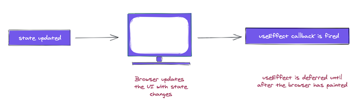

# ⚠ useLayoutEffect



### Timing of an effect <a href="#timingofaneffect" id="timingofaneffect"></a>

There’s a very big difference between when the `useEffect` callback is invoked and when class methods such as `componentDidMount` and `componentDidUpdate` are invoked.

The effect callback is invoked after the browser layout and painting are carried out. This makes it suitable for many common side effects, such as setting up subscriptions and event handlers since most of these shouldn’t block the browser from updating the screen.



This is the case for `useEffect`, but this behavior is not always ideal.

What if you wanted a side effect to be visible to the user before the browser’s next paint? Sometimes, this is important to prevent visual inconsistencies in the UI,.

For such cases, React provides another Hook called `useLayoutEffect`. It has the same signature as `useEffect`; the only difference is in when it’s fired, i.e., when the callback function is invoked.

> **N.B.**, although `useEffect` is deferred until the browser has painted, **it is still guaranteed to be fired before any re-renders. This is important.**

.png>)

React will always flush a previous render’s effect before starting a new update.

### `useLayoutEffect` <a href="#uselayouteffect" id="uselayouteffect"></a>

[`useLayoutEffect`](https://reactjs.org/docs/hooks-reference.html#uselayouteffect) has the very same signature as `useEffect`. We’ll discuss the difference between `useLayoutEffect` and `useEffect` below.

```
useLayoutEffect(() => {
//do something
}, [arrayDependency])
```

#### Similar usage as `useEffect`

Here’s the same example for `useEffect` built with `useLayoutEffect`:

```
const ArrayDep = () => {
    const [randomNumber, setRandomNumber] = useState(0)
    const [effectLogs, setEffectLogs] = useState([])
  
    useLayoutEffect(
      () => {
        setEffectLogs(prevEffectLogs => [...prevEffectLogs, 'effect fn has been invoked'])
      },
      [randomNumber]
    )
  
    return (
      <div>
        <h1>{randomNumber}</h1>
        <button
          onClick={() => {
            setRandomNumber(Math.random())
          }}
        >
          Generate random number!
        </button>
        <div>
          {effectLogs.map((effect, index) => (
            <div key={index}>{'🍔'.repeat(index) + effect}</div>
          ))}
        </div>
      </div>
    )
  }
```



### Why Use `useLayoutEffect`? <a href="#why-use-uselayouteffect" id="why-use-uselayouteffect"></a>

So if `useLayoutEffect` will delay the painting of a component why would we want to use it. The biggest reason for using `useLayoutEffect` is when the code being run directly modifies the DOM in a way that is observable to the user.

For example, if I needed to change the background color of a DOM element as a side effect it would be best to use `useLayoutEffect` since we are directly modifying the DOM and the changes are observable to the user. If we were to use `useEffect` we could run into an issue where the DOM is painted before the `useEffect` code is run. This would cause the DOM element to be the wrong color at first and then change to the right color due to the `useEffect` code.

### You Probably Don't Need `useLayoutEffect` <a href="#you-probably-dont-need-uselayouteffect" id="you-probably-dont-need-uselayouteffect"></a>

As you can see from the previous example, use cases for `useLayoutEffect` are pretty niche. In general it is best to always use `useEffect` and only switch to `useLayoutEffect` when you actually run into an issue with `useEffect` causing flickers in your DOM or incorrect results.

\
