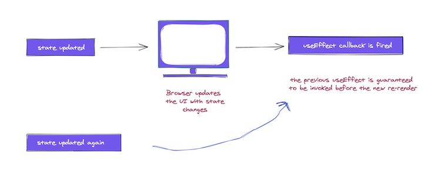

# 🆗 useLayoutEffect



### `useLayoutEffect` <a href="#uselayouteffect" id="uselayouteffect"></a>

Your `useLayoutEffect` callback/effects will be fired _**synchronously**_ after all DOM mutations, i.e., _**before**_ the browser has a chance to paint.

This can be useful if you need to make DOM measurements (like getting the scroll position or other styles for an element) and then make DOM mutations or trigger a synchronous re-render by updating state.

It is recommended that you use `useEffect` when possible to avoid blocking visual updates. However, there are legitimate use cases for `useLayoutEffect`, e.g., to read layout from the DOM and synchronously re-render.

If you are migrating code from a class component, `useLayoutEffect` fires in the same phase as `componentDidMount` and `componentDidUpdate`, but start with `useEffect` first, and only try `useLayoutEffect` if that causes a problem. Don’t block visual updates except when you’re absolutely sure you need to.

It’s also worth mentioning that with server-side rendering, neither `useEffect` nor `useLayoutEffect` are run until JavaScript is downloaded on the client.

You’ll get a warning with server-rendered components containing `useLayoutEffect`. To resolve this, you can either move the code to `useEffect`, i.e., to be fired after first render (and paint), or delay showing the component until after the client renders.

```
useLayoutEffect(() => {
//do something
}, [arrayDependency])
```


It looks exactly like useEffect but different use-cases. Here is the syntax for it;\


```jsx
const component =() => {
    const [randomNumber, setRandomNumber] = useState(0)
    const [effectLogs, setEffectLogs] = useState([])
  
    useLayoutEffect(
      () => {
        setEffectLogs(prevEffectLogs => [...prevEffectLogs, 'effect fn has been invoked'])
      },
      [randomNumber]
    )
  
    return (
      <div>
        <h1>{randomNumber}</h1>
        <button
          onClick={() => {
            setRandomNumber(Math.random())
          }}
        >
          Generate random number!
        </button>
        <div>
          {effectLogs.map((effect, index) => (
            <div key={index}>{'🍔'.repeat(index) + effect}</div>
          ))}
        </div>
      </div>
    )
  }
```


### Timing of an effect <a href="#timingofaneffect" id="timingofaneffect"></a>

There’s a very big difference between when the `useEffect` callback is invoked and when class methods such as `componentDidMount` and `componentDidUpdate` are invoked.

The effect callback is invoked after the browser layout and painting are carried out. This makes it suitable for many common side effects, such as setting up subscriptions and event handlers since most of these shouldn’t block the browser from updating the screen.


This is the case for `useEffect`, but this behavior is not always ideal.

What if you wanted a side effect to be visible to the user before the browser’s next paint? Sometimes, this is important to prevent visual inconsistencies in the UI,.

For such cases, React provides another Hook called `useLayoutEffect`. It has the same signature as `useEffect`; the only difference is in when it’s fired, i.e., when the callback function is invoked.

> **N.B.**, although `useEffect` is deferred until the browser has painted, **it is still guaranteed to be fired before any re-renders. This is important.**



React will always flush a previous render’s effect before starting a new update.

### useEffect vs useLayoutEffect <a href="#3-useeffect-vs-uselayouteffect" id="3-useeffect-vs-uselayouteffect"></a>

**useEffect**\
(Component > State Changes > Component Renders > Rendered Component is Printed on Screen > useEffect runs)

> useEffect will run after React renders your component and ensures that your effect callback does not block browser painting.

**useLayoutEffect**\
(Component > State Changes > Component Renders > useLayoutEffect runs > Rendered Component is Printed on Screen)

> useLayoutEffect runs synchronously immediately after React has performed all DOM mutations.\
>

### Why Use `useLayoutEffect`? <a href="#why-use-uselayouteffect" id="why-use-uselayouteffect"></a>

So if `useLayoutEffect` will delay the painting of a component why would we want to use it. The biggest reason for using `useLayoutEffect` is when the code being run directly modifies the DOM in a way that is observable to the user.

For example, if I needed to change the background color of a DOM element as a side effect it would be best to use `useLayoutEffect` since we are directly modifying the DOM and the changes are observable to the user. If we were to use `useEffect` we could run into an issue where the DOM is painted before the `useEffect` code is run. This would cause the DOM element to be the wrong color at first and then change to the right color due to the `useEffect` code.

### You Probably Don't Need `useLayoutEffect` <a href="#you-probably-dont-need-uselayouteffect" id="you-probably-dont-need-uselayouteffect"></a>

As you can see from the previous example, use cases for `useLayoutEffect` are pretty niche. In general it is best to always use `useEffect` and only switch to `useLayoutEffect` when you actually run into an issue with `useEffect` causing flickers in your DOM or incorrect results.

## References and articles :




