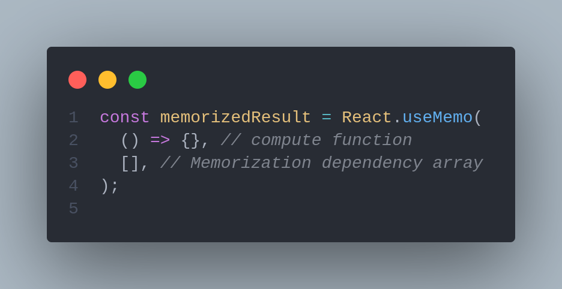
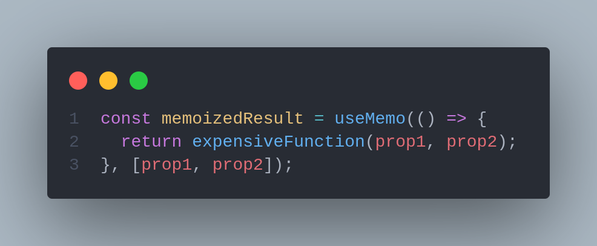

# ❕ useMemo

As Apps grow in size and complexity, creating efficient React code becomes more important than ever. Re-rendering large components is costly, and providing a significant amount of work for the browser through a single-page application (SPA) increases processing time and can potentially drive away users.



A concern that most people have while working with React.js is performance. React is amazing and if used wisely you should not have re-render problems when states change.

First, let's understand the concept of memoization and why we need it.

## Memoization <a href="#f80e" id="f80e"></a>



> In computing, memorization or memorization is an optimization technique used primarily to speed up computer programs by storing the results of expensive function calls and returning the cached result when the same inputs occur again.

Memorization is the idea to keep the value returned of a function or the function itself saved and don’t re-run it if the values sent to it don’t change.


## Understanding JavaScript equality check <a href="#2855" id="2855"></a>

Functions in JavaScript are first-class citizens, meaning that a function is a regular object. The function object can be returned by other functions, be compared, etc exactly like an object.

But if we have one function and run it twice setting it to two different variables and compare it (like below), this will return `false` and we have the same logic applied to objects

```jsx
const sum =()=> {
  return (a, b) => a + b;
}

const sum1 = sum();
const sum2 = sum();
sum1(1, 2); // => 3
sum2(1, 2); // => 3

console.log(sum1 === sum2); // => false
console.log(sum1 === sum1); // => true
```


## **useMemo** <a href="#bfb8" id="bfb8"></a>



The hook `useMemo` receives two parameters: a function that will **compute** and return a value and an array of dependencies (like `useEffect`).&#x20;

During initial rendering, `useMemo(compute, dependencies)` invokes the `compute`  function memorizes the calculation result, and returns it to the component.

If during next renderings the dependencies don't change, then `useMemo()` _doesn't invoke_ `compute` but returns the memorized value.

But if dependencies change during re-rendering, then `useMemo()` _invokes_ `compute` function  memorizes the new value, and returns it.

If your computation callback uses props or state values, then be sure to indicate these values as dependencies:



This hook is normally used when we have some calculation based on a prop (like the example below) or when we want to memorize a component with the props sent.

```jsx
import * as React from "react";

const Element = ({ random }: { random: number }) => {
  const memoized = useMemo(() => (random * 100) / 33, [random]);
  return <>{memoized}</>;
};

export const App =()=> {
  const randomNumber = 100390;

  return <AnotherComponent random={random} />;
}
```

### Factorial example

Every time you change the input value, the factorial is calculated `factorialOf(n)` and `'factorialOf function has been called'` is logged to console.

On the other side, each time you click _Re-render_ button, `inc` state value is updated. Updating `inc` state value triggers `<Factorial />` re-rendering. But, as a secondary effect, during re-rendering the factorial is recalculated again — `'factorialOf function has been called'` is logged to console.

How can you memorize the factorial calculation when the component re-renders? Welcome `useMemo()` hook!

By using `useMemo(() => factorialOf(number), [number])` instead of simple `factorialOf(number)`, React memorizes the factorial calculation.

You can play with the example below and try the two scenarios with useMemo and without




#### **When not to use it** <a href="#e3e7" id="e3e7"></a>

Nothing is bulletproof in real life, so even those hooks that were made to improve performance in some cases will slow down your app.

> Performance optimizations are not free. They ALWAYS come with a cost but do NOT always come with a benefit to offset that cost.

To have the memorization working React needs to deal with this data, calculate it and save it (deals with a garbage collector, etc). My opinion is that those hooks should only be used if:

* You have some calculations that will be computationally expensive
* When you need to compare it (like the case of passing a function down to a Child Component)


### Use memoization with care <a href="#4-use-memoization-with-care" id="4-use-memoization-with-care"></a>

While `useMemo()` can improve the performance of the component, you have to make sure to profile the component with and without the hook. Only after that make the conclusion whether memoization worth it.

When memoization is used inappropriately, it could harm the performance.








