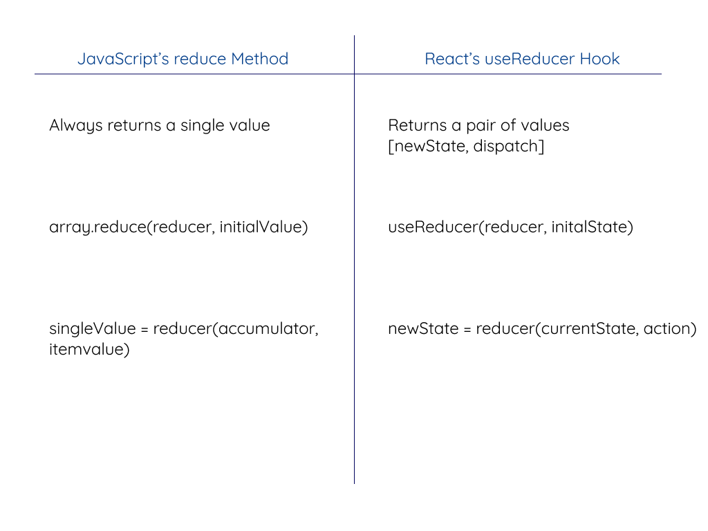
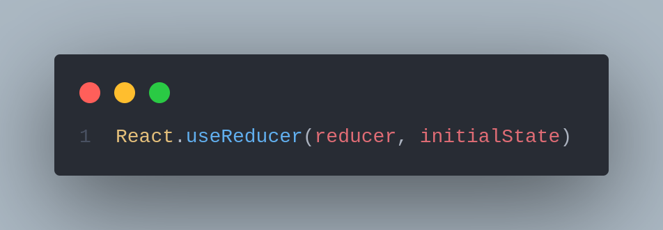

# ❕ useReducer

React's `useState` hook can get you a really long way with React state management. That said, sometimes you want to separate the state logic from the components that make the state changes. In addition, if you have multiple elements of state that typically change together, then having an object that contains those elements of state can be quite helpful.

\
_**According to React's official docs :**_

> _"An alternative to useState. Accepts a reducer of type (state, action) => newState, and returns the current state paired with a dispatch method."_

### A call to Reduce Method in JavaScript

\
To begin with useReducer, first, we need to understand how JavaScript's built-in Array method called Reduce works, which shares remarkable similarity with the useReducer hook.

The reduce method calls a function (a reducer function), operates on each element of an array and always returns a single value.

```
function reducer(accumulator, currentvalue, currentIndex, sourceArray){
  // returns a single value
}

arrayname.reduce(reducer)
```

As stated, the above reducer function takes in 4 parameters -

**1.** _**Accumulator**_ : It stores the callback return values.

**2.** _**Current Value**_ : The current value in the array being processed.

**3.** _**Current Index (optional)**_ : The index of the current value in the array being processed.

**4.** _**Source Array**_ : The source of the array on which reduce method was called upon.

Let's see reduce function in action, by creating a simple array of elements :

```
const items = [1, 10, 13, 24, 5]
```

Now, We will create a simple function called `sum`, to add up all the elements in the items array. The `sum` function is our reducer function, as explained above in the syntax

```
const items = [1, 10, 13, 24, 5]

function sum(a,b, c, d){
    return a + b
}
```

As we can see, I am passing four parameters named `a, b, c, d`, these parameters can be thought of as `Accumulator, Current Value, Current Index, Source Array` respectively.

Finally, calling the `reduce` method on our `sum` reducer function as follows

```
const items = [1, 10, 13, 24, 5];

function sum(a, b, c, d){
    return a + b;
}

const out = items.reduce(sum);

console.log(out);

OUTPUT :
59
```

Let's understand what's going on here :

When the `reduce` method gets called on the `sum` function, the accumulator ( here `a`) is placed on the zeroth index (1), the Current Value (here b) is on `10`. On the next loop of the `sum` function, the accumulator adds up `a + b` from the previous iteration and stores it up in `accumulator` (a) while the current value(b) points to 13 now. Similarly, the accumulator keeps on adding the items from the array whatever the Current Index is pointing until it reaches the very end of it. Hence resulting in the summation of all the items in the array.

```
// We can do a console.log to check iteration in every function loop :

const items = [1,10,13,24,5];

function sum(a, b, c, d){
   console.log("Accumulator", a)
   console.log("Current Index", b)
 	 return a + b
}

const out = items.reduce(sum);

console.log(out);

'Accumulator' 1
'Current Index' 10
'Accumulator' 11
'Current Index' 13
'Accumulator' 24
'Current Index' 24
'Accumulator' 48
'Current Index' 5
53

```

In addition to this, there is an optional `initial value`, when provided will set the accumulator to the initial value first, before going out for the first index item in the array. The syntax could look like this :

```
items.reduce(sum, initial value)
```

While we just finished understanding how the `reduce` method works in JavaScript, turns out both the Redux library and the `useReducer` hook shares a common pattern, hence the similar name.



### How does useReducer works?

useReducer expects two parameters namely, a reducer function and an initial state.



Again the reducer function expects two parameters, a current state and an action and returns a new state.





