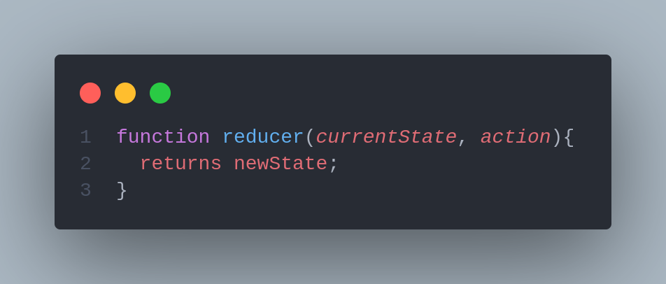
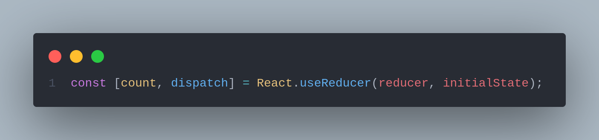

# useReducer

React's `useState` hook can get you a really long way with React state management. That said, sometimes you want to separate the state logic from the components that make the state changes. In addition, if you have multiple elements of state that typically change together, then having an object that contains those elements of state can be quite helpful.

\
_**According to React's official docs :**_

> _"An alternative to useState. Accepts a reducer of type (state, action) => newState, and returns the current state paired with a dispatch method."_

## A call to Reduce Method in JavaScript

\
To begin with useReducer, first, we need to understand how JavaScript's built-in Array method called Reduce works, which shares remarkable similarity with the useReducer hook.

The reduce method calls a function (a reducer function), operates on each element of an array and always returns a single value.

```jsx
function reducer(accumulator, currentvalue, currentIndex, sourceArray){
  // returns a single value
}

arrayname.reduce(reducer)
```

As stated, the above reducer function takes in 4 parameters -

**1.** _**Accumulator**_ : It stores the callback return values.

**2.** _**Current Value**_ : The current value in the array being processed.

**3.** _**Current Index (optional)**_ : The index of the current value in the array being processed.

**4.** _**Source Array**_ : The source of the array on which reduce method was called upon.

Let's see reduce function in action, by creating a simple array of elements :

```jsx
const items = [1, 10, 13, 24, 5]
```

Now, We will create a simple function called `sum`, to add up all the elements in the items array. The `sum` function is our reducer function, as explained above in the syntax

```jsx
const items = [1, 10, 13, 24, 5]

function sum(a,b, c, d){
    return a + b
}
```

As we can see, I am passing four parameters named `a, b, c, d`, these parameters can be thought of as `Accumulator, Current Value, Current Index, Source Array` respectively.

Finally, calling the `reduce` method on our `sum` reducer function as follows

```jsx
const items = [1, 10, 13, 24, 5];

function sum(a, b, c, d){
    return a + b;
}

const out = items.reduce(sum);

console.log(out);

OUTPUT :
59
```

Let's understand what's going on here :

When the `reduce` method gets called on the `sum` function, the accumulator ( here `a`) is placed on the zeroth index (1), the Current Value (here b) is on `10`. On the next loop of the `sum` function, the accumulator adds up `a + b` from the previous iteration and stores it up in `accumulator` (a) while the current value(b) points to 13 now. Similarly, the accumulator keeps on adding the items from the array whatever the Current Index is pointing until it reaches the very end of it. Hence resulting in the summation of all the items in the array.

```jsx
// We can do a console.log to check iteration in every function loop :

const items = [1,10,13,24,5];

function sum(a, b, c, d){
   console.log("Accumulator", a)
   console.log("Current Index", b)
 	 return a + b
}

const out = items.reduce(sum);

console.log(out);

'Accumulator' 1
'Current Index' 10
'Accumulator' 11
'Current Index' 13
'Accumulator' 24
'Current Index' 24
'Accumulator' 48
'Current Index' 5
53

```

In addition to this, there is an optional `initial value`, when provided will set the accumulator to the initial value first, before going out for the first index item in the array. The syntax could look like this :

```jsx
items.reduce(sum, initial value)
```

While we just finished understanding how the `reduce` method works in JavaScript, turns out both the Redux library and the `useReducer` hook shares a common pattern, hence the similar name.


## How does useReducer works?

`useReducer` is used to store and update states, just like the `useState` Hook. but returns an array that holds the current state value and a `dispatch` function, to which you can pass an action and later invoke.&#x20;


**This is similar to the pattern Redux uses but with a few differences.**

**For example, the `useReducer` function is tightly coupled to a specific reducer. We dispatch action objects to that reducer only, whereas in Redux, the dispatch function sends the action object to the store. At the time of dispatch, the components don’t need to know the reducer that will process the action.**


### The reducer function

> The _reducer_ is a pure function that accepts 2 parameters: the _current state_ and an _action object_. Depending on the action object, the reducer function must update the state in an immutable manner, and return the new state.

The `reduce()` method in JavaScript executes a reducer function on each element of the array an and then returns a single value. The `reduce()` method accepts a reducer function, which itself can accept up to four arguments.&#x20;

Again the reducer function expects two parameters, a current state and an action and returns a new state.



This is essentially what happens with `useReducer` in React: it accepts a reducer function that returns a single value.



The reducer function itself accepts two parameters and returns one value. The first parameter is the current state, and the second is the action. The state is the data we are manipulating. The reducer function receives an action, which is executed by a `dispatch` function.

```jsx
function reducer(state, action) { }

dispatch({ type: 'increment' })
```

The action is like an instruction you pass to the reducer function. Based on the action specified, the reducer function execute the necessary state update. If you have used a state management library like Redux then you must have come across this pattern of state management.

### **The initial state**

> The _initial state_ is the value the state is initialized with.

The initial state is the second argument passed to the `useReducer` Hook, and it represents the default state.

```jsx
const initialState = { count: 1 }

// wherever our useReducer is located
const [state, dispatch] = useReducer(reducer, initialState, initFunc)
```

Note that the third argument, which is the `init` function, is optional.

This pattern also follows one of the golden rules of Redux state management: the state should be updated by emitting actions. Never write directly to the state.

It’s worth noting, however, that the Redux `state = initialState` convention doesn’t work the same way with `useReducer`. This is because the initial value sometimes depends on props.

### **Creating the initial state lazily**

In programming, lazy initialization is the tactic of delaying the creation of an object, the calculation of a value, or some other expensive process until the first time it is needed.

As mentioned above, `useReducer` can accept a third parameter, which is an optional `init` function for creating the initial state lazily. It lets you extract logic for calculating the initial state outside of the reducer function, as you can see below:

```jsx
const initFunc = (initialCount) => {
    if (initialCount !== 0) {
        initialCount=+0
    }
  return {count: initialCount};
}

// wherever our useReducer is located
const [state, dispatch] = useReducer(reducer, initialCount, initFunc);
```

The `initFunc` above will reset the `initialCount` to `0` on page mount if the value is not `0` already, and then return the state object. Notice that this `initFunc` is a function, not just an array or object.

### The `dispatch` method

The `dispatch` function accepts an object that represents the type of action we want to execute when it is called. It basically sends the type of action to the reducer function to perform its job, which, of course, is updating the state.

> The _dispatch_ is a special function that dispatches an action object.

The action to be executed is specified in our reducer function, which in turn is passed to the `useReducer`. The reducer function will then return the updated state.

> An _action object_ is an object that describes how to update the state.

The actions that will be dispatched by our components should be represented as one object with the `type` and **optional** `payload` key, where `type` stands as the identifier of the dispatched action and `payload` is the piece of information that this action will add to the state.

The `dispatch` is the second value returned from the `useReducer` Hook and can be used in our JSX to update the state.

```jsx
// creating our reducer function
function reducer(state, action) {
  switch (action.type) {
   // ...
      case 'reset':
          return { count: action.payload };
    default:
      throw new Error();
  }
}

// wherever our useReducer is located
const [state, dispatch] = useReducer(reducer, initialCount, initFunc);

// Updating the state with the dispatch functon on button click
<button onClick={() => dispatch({type: 'reset', payload: initialCount})}> Reset </button>
```

Notice how our reducer function makes use of the payload that is passed from the `dispatch` function. It sets our state object to the payload, i.e., whatever the `initialCount` is.

Of particular note is the fact that we can pass the `dispatch` function to other components through props. This simple fact alone is what allows us to replace Redux with `useReducer`.

Let’s say we have a component we want to pass our dispatch function to as props. We can easily do that like this from the parent component:

```jsx
<Increment count={state.count} handleIncrement={() => dispatch({type: 'increment'})}/>
```

Now, in the child component, we receive the props, which, when emitted, will trigger the dispatch function and update the state:

```jsx
<button onClick={handleIncrement}>Increment</button>
```

Wiring all these terms together, here's how the state update using a reducer works.


As a result of an event handler or after completing a fetch request, you call the _dispatch_ function with the _action object_.

Then React redirects the action object and the current state value to the _reducer_ function.

The reducer function uses the action object and performs a state update, returning the new state.

React then checks whether the new state differs from the previous one. If the state has been updated, React re-renders the component and `useReducer()` returns the new state value: `[newState, ...] = useReducer(...)`.

Note that `useReducer()` design is based on the [Flux architecture](https://facebook.github.io/flux/docs/in-depth-overview).

If all these terms sound too abstract, then you have the right feeling! Let's see how `useReducer()` works in an interesting example.

### **Bailing out of a dispatch**

If the `useReducer` Hook returns the same value as the current state, React will bail out without rendering the children or firing effects. This is because it uses the [`Object.is`](https://developer.mozilla.org/en-US/docs/Web/JavaScript/Reference/Global\_Objects/Object/is#Description) comparison algorithm.

## Simple Counter Example

Lets take this simple example of a counter with useState and changed to useReducer

```jsx
import * as React from 'react'

function Counter({initialCount = 0, step = 1}) {

  const [count, setCount] = React.useState(initialCount)

  const increment = () => setCount(count + step)
  return <button onClick={increment}>{count}</button>
}

function App() {
  return <Counter />
}

export default App
```

First of all we are going to change the usestate to useReducer


Extracting the reducer function is a pattern that communally used for readability concerns


```jsx
import * as React from 'react'

const countReducer = (count, change) => count + change

function Counter({initialCount = 0, step = 1}) {
  const [count, changeCount] = React.useReducer(countReducer, initialCount)
  const increment = () => changeCount(step)
  return <button onClick={increment}>{count}</button>
}

function Usage() {
  return <Counter />
}

export default Usage
```

How about an object as a state&#x20;

```jsx
import * as React from 'react'

const countReducer = (state, action) => ({...state, ...action})

function Counter({initialCount = 0, step = 1}) {
  const [state, setState] = React.useReducer(countReducer, {
    count: initialCount,
  })
  const {count} = state
  const increment = () => setState({count: count + step})
  return <button onClick={increment}>{count}</button>
}

function App() {
  return <Counter />
}

export default App
```

But how about changing our action to function,


we need to make sure that if action is function it will invoke a function , if not we will used as plane object


```jsx
import * as React from 'react'

const countReducer = (state, action) => ({
  ...state,
  ...(typeof action === 'function' ? action(state) : action),
})

function Counter({initialCount = 0, step = 1}) {
  const [state, setState] = React.useReducer(countReducer, {
    count: initialCount,
  })
  const {count} = state
  const increment = () =>
    setState(currentState => ({count: currentState.count + step}))
  return <button onClick={increment}>{count}</button>
}

function App() {
  return <Counter />
}

export default App
```

Let's change our reducer to the standard convention now

we will going to make a switch statement to switch on the action type , with that with each action we mutate the state

```jsx
import * as React from 'react'

function countReducer(state, action) {
  const {type, step} = action
  switch (type) {
    case 'increment': {
      return {
        ...state,
        count: state.count + step,
      }
    }
    default: {
      throw new Error(`Unsupported action type: ${type}`)
    }
  }
}

function Counter({initialCount = 0, step = 1}) {
  const [state, dispatch] = React.useReducer(countReducer, {
    count: initialCount,
  })
  const {count} = state
  const increment = () => dispatch({type: 'increment', step})
  return <button onClick={increment}>{count}</button>
}

function App() {
  return <Counter />
}

export default App
```

## `useState` vs. `useReducer`

Although `useState` is a [Basic Hook](https://reactjs.org/docs/hooks-reference.html#basic-hooks) for managing simple state transformation and `useReducer` is an [Additional Hook](https://reactjs.org/docs/hooks-reference.html#additional-hooks) for managing more complex state logic, it is worth noting that `useState` uses the `useReducer` internally. This implies that you could use `useReducer` for everything you can do with `useState`.

However, there are some major differences between these two Hooks. `useReducer` lets you avoid passing down callbacks through different levels of your component, instead allowing you to pass a provided `dispatch` function, which in turn will improve performance for components that trigger deep updates.

This does not imply that the `useState` updater function is newly called on each render. What it means is that when you have a complex logic to update state, you simply won’t use the setter directly to update state; instead, you will write a complex function, which in turn would call the setter with updated state.

Therefore, it is recommended to use `useReducer`, which returns a `dispatch` method that doesn’t change between re-renders, and you can have the manipulation logic in the reducers.

It is also worth noting that with `useState`, the state updater function is invoked to update state, but with `useReducer`, the `dispatch` function is invoked instead, and an action with at least a type is passed to it.

Let’s take a look into how both Hooks are declared and used:

### **Declaring state with `useState`**

```jsx
const [state, setState] = useState('default state');
```

`useState` returns an array that holds the current state value and a `setState` method for updating the state.

### **Declaring state with `useReducer`**

```jsx
const [state, dispatch] = useReducer(reducer, initialState)
```

`useReducer` returns an array that holds the current state value and a `dispatch` method that logically achieve the same goal of `setState`, i.e., updating the state.

### **Updating state with `useState`**

```jsx
<input type='text' value={state} onChange={(e) => setState(e.currentTarget.value)} />
```

### **Updating state with `useReducer`**

```jsx
<button onClick={() => dispatch({ type: 'decrement'})}>Decrement</button>
```

We’ll discuss the `dispatch` function in greater depth a bit later. Optionally, an action object may also have a `payload`:

```jsx
<button onClick={() => dispatch({ type: 'decrement', payload: 0})}>Decrement</button>
```

`useReducer` can be handy when managing complex state shape. For example, when the state consists of more than primitive values, like nested arrays or objects:

```
const [state, dispatch] = useReducer(loginReducer,
  {
    users: [
      { username: 'Philip', isOnline: false},
      { username: 'Mark', isOnline: false },
      { username: 'Tope', isOnline: true},
      { username: 'Anita', isOnline: false },
    ],
    loading: false,
    error: false,
  },
);
```

It is easier to manage this local state because the parameters depend on each other, and all the logic could be encapsulated into one reducer.

## Mental Model

let's see a real-world example **i found** that works similarly to a reducer.

Imagine you're the captain of a ship in the first half of the 20th century.


The captain's bridge has a special communication device called _engine order telegraph_ (see the picture above). This communication tool is used to transmit commands from the bridge to the engine room. Typical commands would be to move _back slowly_, move _ahead half_ power, _stop_, etc.

You're on the bridge and the ship is at full stop. You (the captain) want the ship to move forward at full speed. You'd approach the engine order telegraph and set the handle to _ahead full_. The engineers in the engine room, having the same device, see the _ahead full_ command, and set the engine to the corresponding regime.

The _engine order telegraph_ is the _dispatch_ function, the _commands_ are the _action objects_, the _engineers in the engine room_ are the _reducer_ function, and the _engine regime_ is the _state_.

The engine order telegraph helps separate the bridge from the engine room. The same way the `useReducer()` hook helps separate the rendering from the state management logic.

## References and articles :





{% embed url="https://engineering.zalando.com/posts/2016/08/design-patterns-redux.html?gh_src=4n3gxh1%3Fgh_src%3D4n3gxh1" %}






