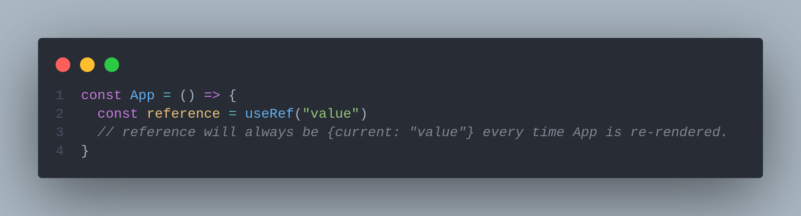
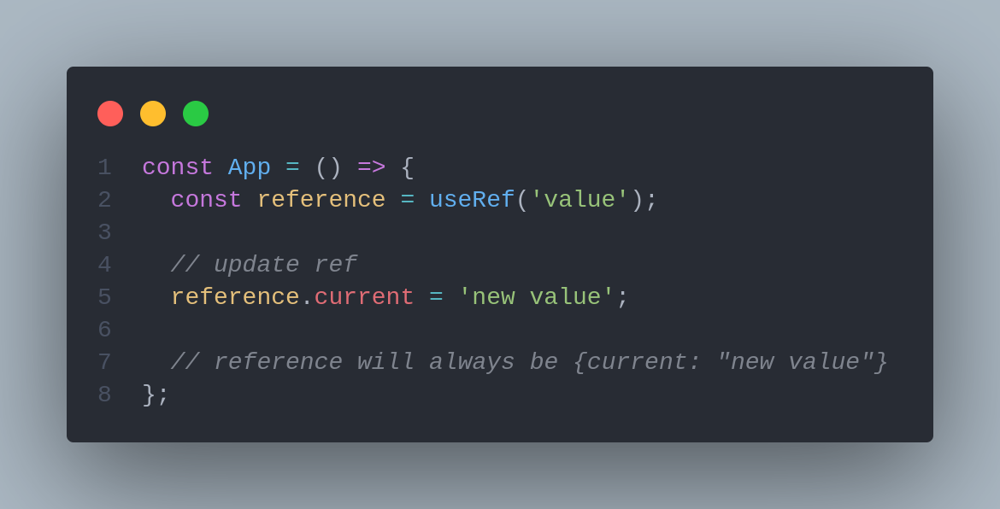
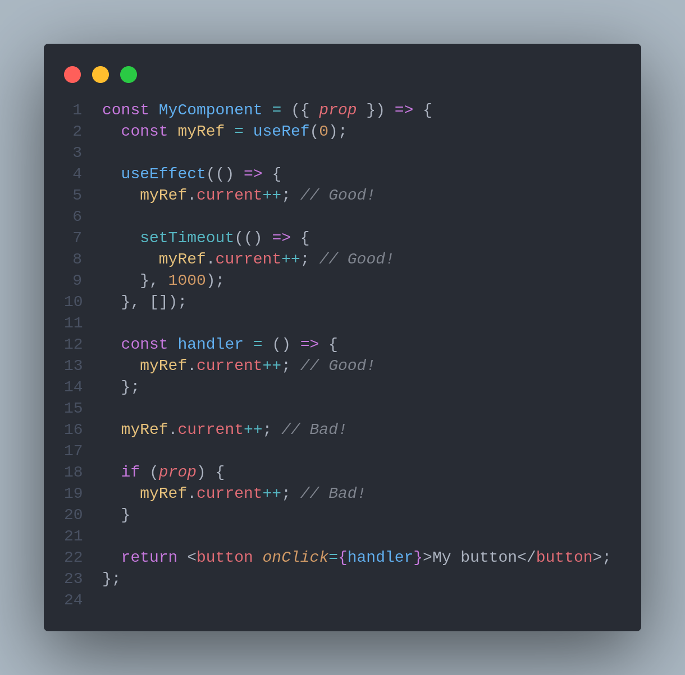

# 🆗 useRef

## What are refs

Sometimes when using React you’ll need an escape hatch to write imperative-style code to interact directly with DOM elements. Using React’s createRef method allows you to do just that!

React provides a way to get references to DOM nodes by using `React.createRef()`. It’s really just an equivalent of this all-too-familiar snippet of JavaScript:

>)

This is exactly what `React.createRef()` does, although it requires a bit of a different setup.

```jsx
import React, { Component } from 'react';

class Component extends Component {
  constructor(props) {
    super(props);
    this.myInput = React.createRef();    // initialize "this.myInput"  
  }

  render() {
    return (
      <input ref={this.myInput}/>        {/* pass "this.myInput" as ref */}
    );
  }
}
```

When working with class-based components in the past, we used `createRef()` to create a ref. However, now that React recommends functional components, and general practice is to follow the Hooks way of doing things, we don’t need to use `createRef()`. Instead, we use `useRef(null)` to create refs in functional components.

## What is useRef used for?

The `useRef` Hook in React can be used to directly access DOM nodes, as well as persist a mutable value across rerenders of a component.

The basic signature for the `useRef` Hook looks like this:

>)

`useRef` returns a mutable object whose value is set as: `{current: initialValue}`.

### Mutable values

The reference object  is mutable which means we can access the reference value using `reference.current` and update it by assigning reference.current to a new value or variable.&#x20;

There are two important behaviours to remember about useRef() references:

1. The reference value stays the same (persists) between component re-renders.
2. Updating a reference value does not re-render the component.

The difference between using `useRef` and manually setting an object value directly within your component, e.g., `const myObject = {current: initialValue}`, is that the `ref` object remains the same all through the lifetime of the component, i.e., across re-renders.



To update the value stored in the `ref` object, you go ahead and mutate the `current` property as follows:



The returned object from invoking `useRef` will persist for the full lifetime of the component regardless of re-renders.

#### Example click count Logger&#x20;

```jsx
import { useRef } from 'react';
const countLogger = () => {
    const reference = useRef(0);

    const handleClick = () => {
        reference.current++;
        console.log(`${reference.current} button clicks`);
    }

    console.log("Component rendered");

    return (
        <button onClick={handleClick}>Click me!</button>
    )
}
```

Here `const reference = useRef(0)` creates a reference reference initialized to 0. We use this reference object to store the number of clicks on a button. On clicking the button, the reference value is updated and logged to the console. As you might have noticed in your console that "Component rendered" is logged only once (during the initial render) which means that the button clicks, more precisely, the reference value updates do not trigger component re-renders.

### Directly access DOM nodes

When combined with the `ref` attribute, we could use `useRef` to obtain the underlying DOM nodes to perform DOM operations imperatively. In fact, this is really an escape hatch. We should only do this sparsely for things that React doesn't provide a declarative API for, such as focus management.&#x20;

One of the many concepts that React popularized among developers is the concept of declarative views. Before declarative views, most of us were modifying the DOM by calling functions that explicitly changed it.

we are now declaring views based on a state, and — though we are still calling functions to alter this state — we are not in control of when the DOM will change or even if it should change.

Because of this inversion of control, we’d lose this imperative nature if it weren’t for refs.

A common use case for `useRef` is to manage child DOM nodes:

```jsx
function TextInputWithFocusButton() {
  //1. create a ref object with initialValue of null
  const inputRef = useRef(null);

  const onButtonClick = () => {
    // 4. `current` points to the mounted text input element
    // 5. Invoke the imperative focus method from the current property
    inputRef.current.focus();
  };

  return (
    <>
      {/* 2. as soon as input is rendered, the element will be saved in the ref object, i.e., {current: *dom node*}  */}
      <input ref={inputRef} type="text" />
      {/* 3. clicking the button invokes the onButtonClick handler above */}
      <button onClick={onButtonClick}>Focus the input</button>
    </>
  );
}
```

The example above works because if you pass a `ref` object to React, e.g., `<div ref={myRef} />`, React will set its `current` property to the corresponding DOM node whenever that node changes, i.e., `myRef = {current: *dom node*}`.

`useRef` returns a plain JavaScript object, so it can be used for holding more than just DOM nodes — it can hold whatever value you want. This makes it the perfect choice for simulating instance-like variables in functional components:

>)

In the example above, we log `initialProp` and `prop` via `useEffect`. This will be logged on mount and every time `prop` changes.

Since `initialProp` is `prop` saved on initial render, it never changes. It’ll always be the initial value of `props`. Here’s what we mean.

If `prop` passed to `App` were changed from **`1`** to **`5`** , coming from state update , the following will be logged:

>)

`initialProp` remains the same through the lifetime of the component because it is saved in the `ref` object. The only way to update this value is by mutating the current property of the `ref` object: `initialProp.current =`` `_`*new value*`_.

With this, you can go ahead and create [instance-like variables](https://reactjs.org/docs/hooks-faq.html#is-there-something-like-instance-variables) that don’t change within your functional component.

Remember, the only difference between `useRef` and creating a `{current: ...}` object yourself is that `useRef` will give you the same `ref` object on every render.

### Integrating with DOM-based libraries

As good as React is, there are a lot of utilities and libraries outside its ecosystem that have been in use on the web for years. For example, using refs allows us to combine React with a great animation library. It’s good to take advantage of their stability and resolution for some specific problems.

The [GSAP library](https://blog.logrocket.com/animations-react-hooks-greensock/) is a popular choice for animation examples. To use it, we need to send a DOM element to any of its methods.



When the element gets unmounted, we’ll clean the DOM state and actions by terminating any ongoing animation with the `kill()` method supplied by the `Timeline` instance.

#### **Ref is null on initial rendering**

During initial rendering, the reference supposed to hold the DOM element is empty:



During initial rendering React still determines what is the output of the component, so there's no DOM structure created yet. That's why `inputRef.current` evaluates to `undefined` during initial rendering.

`useEffect(callback, [])` hook invokes the callback right after mounting, when the input element has already been created in DOM.

`callback` function of the `useEffect(callback, [])` is the right place to access `inputRef.current` because it is guaranteed that the DOM is constructed.

### &#x20;Updating references restriction <a href="#3-updating-references-restriction" id="3-updating-references-restriction"></a>

The function scope of the functional component should either calculate the output or invoke hooks.

That's why updating a reference (as well as updating state) shouldn't be performed inside the immediate scope of the component's function.

The reference must be updated either inside a `useEffect()` callback or inside handlers (event handlers, timer handlers, etc).




#### `useRef` vs. `createRef`

* &#x20;createRef every time when it runs, it creates a new ref object.
* `useRef` only creates a ref object for a particular _component instance_ when it's first rendered. In the following rerenders, it'll just returns the existing ref object associated with that component instance. That's why we can trust it to persist a value across rerenders!


## &#x20;Update state from ref

There’s one more thing to note. `useRef` doesn’t notify you when its content changes, i.e., mutating the `current` property doesn’t cause a re-render. For cases such as performing a state update after React sets the current property to a DOM node, make [useCallback](usecallback.md) ref as follows:

```jsx
function UpdateStateOnSetRef() {
  // set up local state to be updated when ref object is updated
  const [height, setHeight] = useState(0);

  // create an optimised callback via useCallback
  const measuredRef = useCallback(node => {
    // callback passed to "ref" will receive the DOM node as an argument
    if (node !== null) {
      // check that node isn't empty before calling state
      setHeight(node.getBoundingClientRect().height);
    }
  }, []);

  return (
    <>
      {/* pass callback to the DOM ref */}
      <h1 ref={measuredRef}>Hello, world</h1>
      <h2>The above header is {Math.round(height)}px tall</h2>
    </>
  );
}
```

## Difference between state and references

1. Updating state does trigger component re-rendering but updating a reference does not.
2. The state update is asynchronous (state variable is updated after re-rendering - [**read more why is it async** ](https://lifesaver.codes/answer/rfclarification-why-is-setstate-asynchronous)), while the reference update is synchronous.

### forwardRef in React? <a href="#why-do-we-need-forwardref-in-react" id="why-do-we-need-forwardref-in-react"></a>

So what is forwardRef, and why is it important?

Let's start with an example: Let's say we have an `Input` component in our React application that looks like the following:

```javascript
const Input = (props) => {
  return <input {...props} />;
};
```

Now, we also want to focus the input component on the click of a button.

To achieve that, we simply need to create a new reference in our app, pass it down to `Input`, and call `.focus()` on the element, right? Wrong!

By default, the `ref` prop **only works on HTML elements**, not on React components.

When we want to pass down a reference to a React component, **we need to tell React which HTML element it should reference**, as there can be more than one in our component.

That's where `forwardRef` becomes useful. It allows us to specify which exact HTML element we want to reference.

### How to use forwardRef <a href="#how-to-use-forwardref" id="how-to-use-forwardref"></a>

Our task is to forward the ref that the `Input` component receives to the HTML input element.

We do that by wrapping the component in `forwardRef`. The function accepts a callback with two parameters:

1. The component props
2. The ref to be forwarded

This callback is our function component, which now accepts a second property.

```javascript
const Input = forwardRef((props, ref) => {
  // Here goes the content of our component
});
```

In the returned JSX code, we now need to pass the ref we receive in the function to the correct HTML component, which in our case is the `input` element.

```javascript
const Input = forwardRef((props, ref) => {
  return (
    <input
      ref={ref}      {...props}
    />
  );
});
```

Et voilá, focussing the input via refs works!

Here's the code for doing so:

```javascript
import React, { useState, useRef, forwardRef } from 'React';

const Input = forwardRef((props, ref) => {
  return <input ref={ref} {...props} />;
});

const App = () => {
  const inputRef = useRef(null);
  const [value, setValue] = useState('');
  const onInputChange = (e) => {
    e.preventDefault();
    setValue(e.target.value);
  };

  const focus = () => {
    inputRef.current?.focus();
  };

  return (
    <>
      <Input value={value} onChange={onInputChange} ref={inputRef} />
      <button onClick={focus}>Focus</button>
    </>
  );
};
```

#### Custom names for DevTools <a href="#custom-names-for-devtools" id="custom-names-for-devtools"></a>

The `forwardRef` function **takes the name of the component from the function** it accepts as a parameter. If you're using anonymous or arrow functions, your DevTools will display the component like this:


There are a few ways to avoid this. First, you could use a regular function expression with a name like this:

```javascript
const Input = forwardRef(function Input(props, ref) {
  return <input ref={ref} {...props} />;
});
```

If you're like me and haven't used this syntax in the last three years, you can also set the display name manually by adding the following line to the end of the file:

```javascript
Input.displayName = 'Input';

```

## References and articles :




