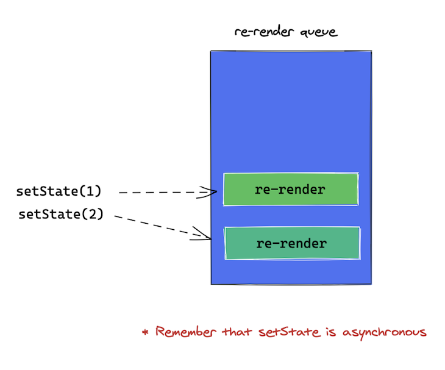
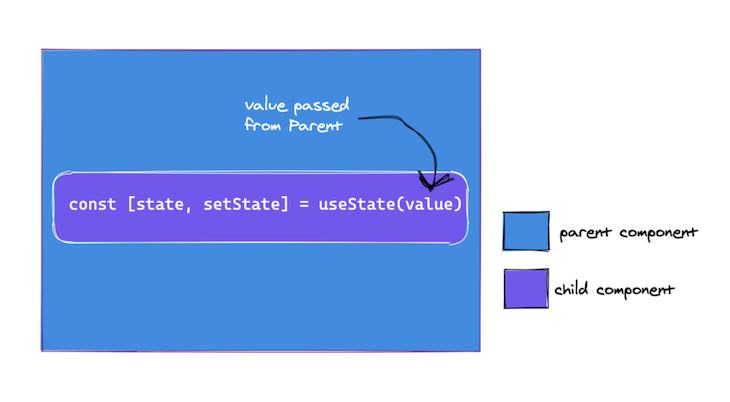

# useState











The signature for the `useState` Hook is as follows:

```jsx
                 const [state, setState] = useState(initialState);
//                        👆      👆 
// Think about it as a getter and a setter
```

Here, `state` and `setState` refer to the state value and updater function returned on invoking `useState` with some `initialState`.

It’s important to note that when your component first renders and invokes `useState`, the `initialState` is the returned state from `useState`.

## Declare State Variable <a href="#declare-state-variable" id="declare-state-variable"></a>


**Always remember that the value of the state is always the initial state value on the first render**


```jsx
 const [state] = useState(100)
  return <div> State variable is {state}</div>
```

## Update State Variable <a href="#update-state-variable" id="update-state-variable"></a>

Also, to update state, the state updater function `setState` should be invoked with a new state value, as shown below:

```
setState(newValue)
```

By doing this, a new re-render of the component is queued. `useState` guarantees that the `state` value will always be the most recent after applying updates.



For referential checks, the `setState` function’s reference never changes during re-renders.

Here an example of a Counter component that use `useState` to update the counter by one for each click

```jsx
const Counter = () => {
  const [counter, setCounter] = useState(0)
  const handleClick = () => setCounter(counter + 1)

  return (
    <div>
      Counter:{counter}
      <div>
        <button onClick={handleClick}>Get older! </button>
      </div>
    </div>
  )
}
```

### Functional updates <a href="#functionalupdates" id="functionalupdates"></a>

The state updater function returned by `useState` can be invoked in two ways. The first is by passing a new value directly as an argument:

```
const [state, setState] = useState(initialStateValue)

// update state as follows
setState(newStateValue)
```

This is correct and works perfectly in most cases. However, there are cases where a different form of state update is preferred: _**functional updates**_.

Here’s the example above revised to use the functional update form:

```
const [state, setState] = useState(initialStateValue)

// update state as follows
setState((previousStateValue) => newValue)
```


You pass a function argument to `setState`. Internally, React will invoke this function with the previous state as an argument. Whatever is returned from this function is set as the new state.


When your new state depends on the previous state value — e.g., a computation — favor the functional state update. Since `setState` is async, React guarantees that the previous state value is accurate.

Here’s an example:

```
const Counter = () => {
  const [count, setCount] = useState(0);
  return (
    <>
      <p>Count value is: {count}</p>
      <button onClick={() => setCount(0)}>Reset</button>
      <button 
        onClick={() => setCount(prevCount => prevCount + 1)}>
        Plus (+)
      </button>
      <button 
        onClick={() => setCount(prevCount => prevCount - 1)}>
       Minus (-)
      </button>
    </>
  );
}
```

In the example above, the button grows every time it’s clicked. Since the new state value depends on the old, the functional update form of `setState` is preferred.

### Lazily initializing state <a href="#lazilyinitializingstate" id="lazilyinitializingstate"></a>

The `initialState` argument to `useState` is only used during your initial render.



```
// this is OK 
const [state, setState] = useState(10) 

// subsequent prop updates are ignored 
const App = ({myProp}) => {
  const [state, setState] = useState(myProp)
}
// only the initial myProp value on initial render is passed as initialState. subsequent updates are ignored.

```

However, if the initial state is a result of an expensive computation, you could also pass a function, which will be invoked only on initial render:

```
const [state, setState] = useState(() => yourExpensiveComputation(props))
```

### Initialize state from function

As opposed to just passing an initial state value, state could also be initialized from a function, as shown below:

```
const StateFromFn = () => {
  const [token] = useState(() => {
    let token = window.localStorage.getItem("my-token");
    return token || "default#-token#"
  })

  return <div>Token is {token}</div>
}
```

### **use with objects**

As opposed to strings and numbers, you could also use an object as the initial value passed to `useState`.

Note that you have to pass the entire object to the `useState` updater function because the object is replaced, not merged.

Consider the following code block:

```
function CanYouFigureThisOut() {
  const [state, setState] = useState({ name: "React" });
  const updateState = () => setState({ creator: "Facebook" });
  return (
    <>
      <pre>{JSON.stringify(state)}</pre>
      <button onClick={updateState}>update state</button>
    </>
  );
}
```

The string {name: ‘React’} printed to the screen.

When you click the update state button, which of the state values below is printed?

```
//1. 
{"name": "React", "creator": "Facebook"}

//2. 
{"creator": "Facebook"}

//3. 
{"name": "React"}
```

The correct answer is `2` because with Hooks, the updater function does _not_ merge objects, unlike the `setState` function in class components. It replaces the state value with whatever new value is passed as an argument.

Here’s how to fix that using the functional update form of the state updater function:

```
const updateState = () =>  setState((prevState) => ({ ...prevState, creator: "Facebook" }));
```

Pass a function to `setState` and return a merged object by using the [spread operator](https://developer.mozilla.org/en-US/docs/Web/JavaScript/Reference/Operators/Spread\_syntax) ([`Object.assign` also works](https://developer.mozilla.org/en-US/docs/Web/JavaScript/Reference/Global\_Objects/Object/assign)).

### **use with arrays**

Remember: state can hold any kind of value! Here’s an example of useState holding an array.

Typing into the box and hitting Enter will add an item to the list.

```
function ListOfThings() {
  const [items, setItems] = useState([]);
  const [itemName, setItemName] = useState("");

  const addItem = event => {
    event.preventDefault();
    setItems([
      ...items,
      {
        id: items.length,
        name: itemName
      }
    ]);
    setItemName("");
  };

  return (
    <>
      <form onSubmit={addItem}>
        <label>
          <input
            name="item"
            type="text"
            value={itemName}
            onChange={e => setItemName(e.target.value)}
          />
        </label>
      </form>
      <ul>
        {items.map(item => (
          <li key={item.id}>{item.name}</li>
        ))}
      </ul>
    </>
  );
}
```

Notice we’re calling useState with an initial value of an empty array `[]`, and take a look at the `addItem` function.

The state updater (`setItems`, here) doesn’t “merge” new values with old – it overwrites the state with the new value. This is very different from how `this.setState` worked in classes!

So in order to add an item to the array, we’re using the ES6 spread operator `...` to copy the existing items into the new array, and inserting the new item at the end.

Also, just to note, this example uses `const` and an arrow function instead of the `function` from the last example. I wanted to show that either way works.

### **M**ultiple calls to useState

If you want to store multiple values in a function component, you’ve got a couple options:

* call `useState` more than once
* shove everything into an object

There’s nothing wrong with calling `useState` multiple times, and in most cases, that’s how I store multiple values. Once you get over 4 or 5 useState calls it gets a bit unwieldy, but if you’re fine with it, React is too.

Multiple state variables may be used and updated from within a functional component as shown below:

```
() => {
  const [age, setAge] = useState(19)
  const [siblingsNum, setSiblingsNum] = 
    useState(10)

  const handleAge = () => setAge(age + 1)
  const handleSiblingsNum = () => 
      setSiblingsNum(siblingsNum + 1)
 

  return (
    <div>
      <p>Today I am {age} Years of Age</p>
      <p>I have {siblingsNum Multiple state variables may be used and updated from within a functional component as shown below:} siblings</p>

      <div>
        <button onClick={handleAge}>
          Get older! 
        </button>
        <button onClick={handleSiblingsNum}>
            More siblings! 
        </button>
      </div>
    </div>
  )
}
```
